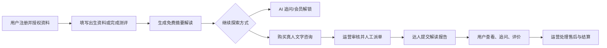
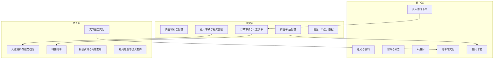
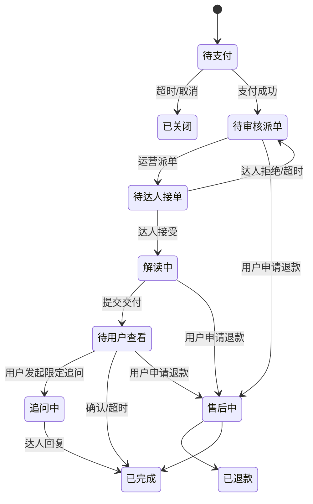

# 一期功能架构与范围表

> 版本：V1.0
>
> 目标：在不建设实时音视频、语音房和复杂社区的前提下，跑通“测算解读 + AI 追问 + 异步真人文字咨询 + 付费交付”的最小可变现闭环。

## 1. 一期业务目标

面向有自我探索、情感关系、事业方向等需求的用户，提供基于出生资料或测试答案的个性化解读；用户可继续向 AI 追问，或购买真人异步文字咨询。平台通过会员、报告解锁和真人咨询订单获得收入。

一期中的真人咨询为**线上异步文字交付**，不是线下面谈，也不是实时聊天：用户下单后，由运营人工派单；达人在承诺时限内提交文字解读，用户在站内查看并可进行有限次追问。

一期用户端采用 **Flutter 开发 iOS/Android App**。Flutter 负责业务 UI 与导航，通过插件或少量原生 Channel 集成支付、推送、权限、上传、分享等平台能力；不采用以 WebView 为主体的套壳方案。

## 2. 一期最小闭环

### 闭环验收标准

1. 用户可完成资料填写并生成至少一种解读结果。
2. 用户可购买一个标准化真人咨询服务，并完成支付。
3. 运营可查看订单、审核信息并分配给达人。
4. 达人可访问已授权资料并提交文字解读。
5. 用户可收到站内通知、查看交付物、评价或发起一次追问。
6. 运营可处理退款/投诉并保留订单与操作记录。

## 3. 三端功能架构

### 3.1 一期使用载体与技术边界

| 端 | 一期使用载体 | UI/实现方式 | 说明 |
| --- | --- | --- | --- |
| 用户端 | iOS/Android App | Flutter | 用户完成资料、测算、报告、AI 追问、下单、支付、交付查看和评价；业务 UI 以 Flutter 页面为主。 |
| 运营端 | PC 浏览器 | Web 管理后台 | 面向运营、客服、审核和管理员，适合内容配置、订单筛选、人工派单和售后处理。 |
| 达人端 | PC 浏览器 | Web 工作台 | 面向异步文字交付；适合查看资料、撰写长报告、处理追问和查看收入。 |
| 营销/分享页 | 移动浏览器或 App 内嵌页面 | H5，可选 | 仅用于活动、协议和分享落地页；不承担一期核心订单、支付和报告流程。 |

### 3.2 Flutter 平台能力

Flutter 并不需要传统 WebView 套壳，但仍需通过 Flutter 插件或原生 Channel 对接 iOS/Android 系统能力。以下能力纳入一期基础底座：

| 能力 | 一期要求 | 关键约束 |
| --- | --- | --- |
| 登录与会话 | 登录、Token 刷新、设备标识、退出登录 | App 与后端统一鉴权；不得将长期凭证写入不安全存储。 |
| 支付 | 调起一个主支付渠道、支付回调、服务端验签、补单 | 以服务端订单状态为准；客户端回调不能作为成功唯一依据。 |
| 推送与站内通知 | 订单状态、派单结果、交付完成、售后结果通知 | 推送点击可直达对应订单/报告；推送不可达时保留站内消息。 |
| 图片/文件上传 | 相机、相册、文件选择、上传进度与失败重试 | 仅允许服务需要的文件类型和大小；上传前说明资料用途。 |
| 权限与隐私 | 相册/相机等运行时权限、出生资料授权、隐私政策同意记录 | 遵循最小权限；拒绝授权时提供可理解的降级路径。 |
| 分享与深链 | 分享报告/活动、外链处理、通知点击/分享回流跳转 | 分享内容脱敏；深链必须校验登录态和目标资源权限。 |
| 稳定性与观测 | 崩溃监控、性能埋点、网络异常页、关键链路日志 | 覆盖登录、生成报告、支付、订单交付等关键链路。 |
| 版本与配置 | 强制/可选更新提示、远程配置、接口版本兼容 | 支付和订单状态机变更需兼容旧 App 版本。 |

## 4. 用户端一期范围

| 功能域 | 一期必须实现 | 一期实现方式/约束 | 后置功能 |
| --- | --- | --- | --- |
| App 基础能力 | Flutter 路由、登录态、原生桥接、崩溃监控、版本更新 | 业务页面使用 Flutter；支付、推送、上传、权限和分享由插件/原生 Channel 集成 | 大规模离线能力、复杂热更新、原生性能专项优化 |
| 账号与授权 | 手机号或微信登录、隐私政策同意、资料授权 | 咨询订单中单独确认出生资料授权范围 | 多账号绑定、家庭档案 |
| 个人资料 | 性别、出生日期时间、出生地、现居地 | 支持编辑；变更后提示解读可能更新 | 资料版本历史、精细隐私可见范围 |
| 测算与解读 | 至少一个主解读方向，建议优先星座/星图或人格测试 | 生成免费摘要与可付费解锁的完整内容 | 同时覆盖全部命理工具、复杂合盘 |
| AI 追问 | 基于当前报告或用户提问生成文字答复 | 限次数；展示免责声明与风险提示 | 长期记忆、语音对话、角色陪伴 |
| 真人咨询入口 | 达人列表、服务卡片、价格、响应时限、下单 | 优先标准化“文字解读报告”服务 | 实时在线状态、实时聊天、语音视频 |
| 下单与支付 | 选择服务、填写问题、授权资料、支付、订单状态 | 接入一个主支付渠道；支付回调必须幂等 | 组合购、多人拼单、分期 |
| 订单与交付 | 待支付、待派单、解读中、待查看、已完成、售后中 | 用户站内查看报告；允许一次限字数追问 | 多轮实时对话、交付物协同编辑 |
| 评价与售后 | 星级/标签评价、问题反馈、退款申请 | 订单完成后开放评价；售后转运营人工处理 | 公开评价社区、达人申诉互动 |
| 会员与卡券 | 一个会员方案或报告解锁二选一；新人券/通用券 | 权益校验、有效期与使用记录必须可查 | 多等级会员、积分体系、复杂营销叠加 |
| 通知 | 订单状态、交付完成、售后结果的站内消息与系统推送 | 推送点击直达订单/报告；站内消息作为通知兜底 | 精细化人群触达、自动化召回 |

## 5. 运营端一期范围

运营端是一期可上线的必要条件，而非后置模块。建议先做 Web 后台，避免将规则、派单和售后依赖研发手工处理。

| 功能域 | 一期必须实现 | 核心字段/动作 | 后置功能 |
| --- | --- | --- | --- |
| 运营账号与权限 | 管理员、运营、客服、审核员角色 | 最小权限、操作日志 | 复杂组织架构、细粒度数据权限 |
| 内容/报告配置 | 解读模板、免责声明、AI 提示词或知识内容配置 | 草稿、发布、下线、版本号 | 可视化规则编排、A/B 实验 |
| 测评题库配置 | 题目、选项、分值/标签、结果模板 | 发布前校验；已作答任务固定版本 | 高级题库分支、动态难度 |
| 商品与权益 | 真人服务商品、价格、交付时限、可用达人；会员或报告商品 | 上下架、库存/名额、券适用范围 | 套餐组合、动态定价、促销引擎 |
| 订单工作台 | 订单检索、支付状态、资料授权、订单状态流转 | 审核、取消、人工派单、超时标记 | 自动派单、复杂 SLA 编排 |
| 达人管理 | 入驻资料审核、服务标签、可接单状态、结算规则 | 启用/停用、服务价格与时限审核 | 达人分级、自动评分、培训体系 |
| 客服与售后 | 退款申请、投诉工单、处理记录、凭证查看 | 同意退款、驳回、补偿、封禁建议 | 智能客服、自动仲裁 |
| 风控与合规 | 敏感词/禁问提示、举报受理、免责声明、资料授权记录 | 订单与报告留痕、人工复核 | 实时内容审核、风险模型 |
| 基础数据看板 | 注册、资料完成、报告生成、支付、订单、交付、退款数据 | 按日期和服务商品查看漏斗 | 用户分群、归因、多维经营分析 |

## 6. 达人端一期范围

一期不必开发独立原生 App。可采用受控的 H5 或 Web 工作台，确保达人只能访问自己被分配且用户已授权的订单。

| 功能域 | 一期必须实现 | 一期实现方式/约束 | 后置功能 |
| --- | --- | --- | --- |
| 达人登录 | 账号登录、身份校验 | 由运营创建/审核账号 | 自助注册、第三方认证 |
| 服务档案 | 头像、昵称、擅长标签、服务说明、价格、响应时限 | 运营审核后才对用户展示 | 达人自主调价、复杂排班 |
| 接单工作台 | 待接、进行中、待追问、已完成订单列表 | 达人可接受或拒绝；超时通知运营 | 自动抢单、智能推荐订单 |
| 用户资料查看 | 查看问题、补充信息、已授权出生资料和已生成报告 | 仅在订单有效期内可见；禁止导出 | 跨订单用户画像、长期 CRM |
| 报告交付 | 富文本文字解读、固定结构模板、提交发布 | 提交后可先进入运营质检或直接交付 | 图片/音频附件、协同撰写 |
| 追问处理 | 接收一次追问、回复并关闭订单 | 限定次数和时限 | 实时聊天、无限追问套餐 |
| 收入查看 | 已完成订单金额、预计收入、结算状态 | 由运营线下或后台统一结算 | 自助提现、发票、分账系统 |
| 规则与申诉 | 服务规范、禁问规则、违规提醒、订单申诉入口 | 运营人工处理申诉 | 在线培训、信用分模型 |

## 7. 一期关键状态机

### 7.1 真人咨询订单

### 7.2 必须统一的订单规则

- 支付成功后才允许派单和查看授权资料。
- 运营派单、达人接单、达人查看资料、提交报告、用户追问和售后处理必须记录操作者与时间。
- 达人拒单或超时后，订单回到待派单队列；不得让用户自行承担无达人接单风险。
- 报告提交后允许运营质检；若被打回，用户不可见未通过内容。
- 退款规则、追问次数和交付时限必须按服务商品固化到订单快照，后续改价不影响历史订单。

## 8. 一期不做清单

以下能力不阻断最小闭环，建议明确后置，避免一期范围膨胀：

- 实时文字聊天、语音连麦、视频咨询、直播房和语音房。
- 以 WebView/H5 为主体的用户端业务实现；核心测算、订单、支付和报告页面保持 Flutter 原生渲染。
- 达人自助提现、自动分账、复杂税务与发票系统。
- 自动智能派单、达人实时排班、动态定价。
- 复杂关系社交、分身雷达、小组、公开内容评论体系。
- 全量命理工具、复杂多对象合盘和深度自定义报告。
- 商城、虚拟币、积分成长体系及大促营销引擎。
- 多渠道推送自动化、用户标签与精细化召回。

## 9. 一期优先级与交付顺序

| 顺序 | 交付包 | 主要产出 | 上线必要性 |
| --- | --- | --- | --- |
| 1 | 基础底座 | Flutter App 壳、用户、角色权限、资料、授权、支付/推送/上传集成、站内通知、审计日志 | 必须 |
| 2 | 测算报告 | 一个主测算、报告模板、结果页、报告解锁 | 必须 |
| 3 | AI 服务 | AI 追问、次数权益、风险提示与日志 | 建议必须 |
| 4 | 真人交易 | 服务商品、订单、支付、状态流转、用户交付页 | 必须 |
| 5 | 运营派单 | 后台订单工作台、达人管理、人工派单、售后 | 必须 |
| 6 | 达人工作台 | 接单、查看授权资料、提交报告、一次追问 | 必须 |
| 7 | 会员/卡券 | 一种会员或报告解锁、新人券、权益核销 | 视商业策略二选一 |
| 8 | 数据与优化 | 核心漏斗看板、异常告警、转化优化 | 必须基础版 |

## 10. 一期核心指标

| 指标 | 定义 | 目的 |
| --- | --- | --- |
| 资料完成率 | 完成出生资料的用户 / 进入资料页用户 | 判断建档门槛 |
| 报告生成成功率 | 成功生成报告 / 发起测算任务 | 判断核心内容稳定性 |
| 报告到 AI 追问率 | 发起 AI 追问用户 / 查看报告用户 | 判断持续探索意愿 |
| 真人咨询支付转化率 | 支付咨询用户 / 进入咨询详情用户 | 判断付费需求 |
| 派单时效 | 支付成功至达人接单的中位时长 | 判断供给调度效率 |
| 按时交付率 | 在商品承诺时限内交付订单 / 已完成订单 | 判断履约质量 |
| 追问率 | 发起追问订单 / 已交付订单 | 判断报告是否满足用户需求 |
| 退款/投诉率 | 退款或投诉订单 / 已支付订单 | 判断服务风险 |
| 复购率 | 在周期内再次购买用户 / 已付费用户 | 判断长期价值 |

## 11. 上线前决策清单

以下事项需要产品、运营、法务和技术在研发开始前确认：

1. 一期主解读方向：星图、星座、生辰或人格测试中选择一个作为主入口。
2. 真人服务的标准商品：交付时限、字数/结构、是否允许追问、定价和退款条件。
3. 用户出生资料、咨询问题和达人报告的保存期限、查看范围及删除规则。
4. “心理咨询”“情感陪伴”“命理解读”各自允许的服务描述与禁问边界。
5. 是否先采用“运营质检后交付”，以及质检 SLA。
6. 支付主体、发票/收款规则、达人结算与平台抽成规则。
7. 首期达人数量、值班能力、拒单率预期与人工派单责任人。
8. 会员与单次付费的优先策略：建议一期先选择一种作为主转化方式，避免权益规则过早复杂化。
