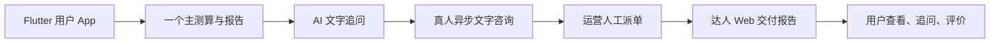

# 一期报价方案对比

> 版本：V1.0
>
> 目标：在既定的 Flutter 用户端、PC Web 运营端、PC Web 达人端架构下，为“测算解读 + AI 追问 + 异步真人文字咨询”提供三套可直接用于询价和立项讨论的实施方案。
>
> 估算口径：人民币，包含产品梳理、UI/UX、开发、测试、上线支持；不含真人达人报酬、内容专家费用、公司主体注册、法务正式审查、渠道保证金及长期云资源消耗。实际报价会受团队城市、是否全职、设计稿完整度和已有后端资产影响。

## 1. 共同前提

三套方案都遵守以下业务与技术决策，区别只在自动化程度、功能广度、质量保障和上线规模。

- **用户端**：Flutter 开发 iOS/Android App；核心业务页面不用 WebView 承载。
- **运营端**：PC 浏览器 Web 后台，承担内容配置、订单查看、人工派单、达人审核和售后。
- **达人端**：PC 浏览器 Web 工作台，承担接单、查看已授权资料、提交文字报告、处理一次追问。
- **真人服务方式**：非实时、线上异步文字交付。用户付款后由运营人工派单；达人按服务承诺时限提交报告。
- **一期不做**：实时 IM、语音/视频咨询、直播/语音房、自动派单、达人自助提现、复杂社区、商城、虚拟币、复杂营销和全量测算工具。
- **合规边界**：产品使用“自我探索、情感陪伴、内容解读”措辞；显著展示娱乐/非专业建议免责声明；出生资料按订单授权并留痕。

## 2. 三种方案总览

| 维度 | A. 成本最小：验证版 | B. 成本中等：可上线经营版 | C. 成本最高：可规模化基础版 |
| --- | --- | --- | --- |
| 适合目标 | 验证是否有人愿意付费 | 正式上线并稳定运营 | 为增长和多达人供给打基础 |
| 预计开发周期 | 6-8 周 | 12-16 周 | 20-28 周 |
| 一次性研发交付估算 | 15-30 万 | 45-80 万 | 100-180 万 |
| 首月第三方/云资源 | 0.3-1 万 | 1-3 万 | 3-8 万 |
| 建议首期达人数量 | 3-10 人 | 10-30 人 | 30-100 人 |
| 主测算方向 | 仅 1 个，优先人格测试 | 1 个主方向 + 1 个补充方向 | 人格 + 星图/星座 + 生辰中的 2-3 个 |
| AI 能力 | 非流式单轮追问 | 报告上下文、多轮追问、基础审核 | 报告上下文、知识库/RAG、限流和降级 |
| 交易 | 单一商品、单一支付渠道 | 报告解锁 + 真人服务 + 基础优惠券 | 多商品、多权益、会员、优惠券和退款规则 |
| 运营派单 | 表格/后台订单列表 + 人工通知 | Web 后台派单、SLA、售后工单 | 规则推荐、队列、质检、完整数据看板 |
| 达人端 | 受控表单/H5 或极简 Web | Web 工作台 | 完整 Web 工作台、收入与质检反馈 |
| 推荐程度 | 适合预算极低或概念验证 | **最推荐** | 适合已有供给和获客预算 |

## 3. 方案 A：成本最小验证版

### 3.1 适用条件

- 目标是验证用户是否愿意为“报告 + 真人解读”付费。
- 团队可接受部分运营流程通过人工工具执行。
- 初期仅服务少量付费用户，允许运营人员手动跟进订单。
- 不追求首发即进入多应用市场，优先 Android 内测包或企业/测试分发；iOS 可后置到验证通过后。

### 3.2 功能范围

| 端 | 一期交付 | 明确简化方式 |
| --- | --- | --- |
| Flutter 用户端 | 登录、资料填写、一个人格测试或一个固定模板报告、报告结果、单轮 AI 追问、真人服务介绍、提交问题、订单状态、交付报告查看 | 视觉采用少量通用组件；仅实现核心页面；不做复杂个人中心、卡券、消息中心和达人搜索筛选。 |
| 运营端 | 订单列表、订单详情、人工改订单状态、导出订单、达人分配记录 | 可使用低代码后台、Retool/Appsmith/现成 Admin 模板；内容与商品配置采用固定数据或配置文件。 |
| 达人端 | 受控 Web 表单或轻量 H5：查看订单、提交文字报告、回复一次追问 | 不做独立达人账号体系；可通过一次性安全链接或运营创建账号访问。 |
| 后端 | 用户、资料、测算任务、订单、报告、授权记录的最小 API | 可采用 BaaS/Serverless 减少后端工作；不做复杂权限、结算和数据分析。 |

### 3.3 对报价关键问题的解决方案

| 问题 | A 方案决策 |
| --- | --- |
| 主解读方向 | 优先选择 **隐藏人格类型测试**。题目、五级量表、结果模板清晰，算法可用规则计分实现，成本最低。 |
| 报告来源 | 固定题库 + 规则计分 + 固定文案模板；不在一期训练/采购命理算法。 |
| AI 追问 | 接入一家大模型 API，最多 1 次追问或每日 1 次；传入报告摘要，不做知识库和流式输出。 |
| 真人服务商品 | 仅 1 个商品，例如“24 小时文字解读报告，含 1 次追问”。 |
| 支付 | 仅 Android/微信支付或测试阶段人工收款后运营改状态；**不建议在 iOS 上用人工绕开 App Store 支付规则进行正式商业化**。 |
| 订单派发 | 运营通过后台/表格手动派单，使用企业微信、短信或邮件通知达人。 |
| 达人结算 | 线下人工结算，后台仅记录订单金额和结算状态。 |
| 推送 | 站内订单状态页 + 短信/企业微信人工通知；不集成厂商推送。 |
| 上线渠道 | Android 内测或小范围灰度；iOS 仅 TestFlight 测试，不以正式商业化为目标。 |

### 3.4 建议团队与工期

| 角色 | 估计投入 |
| --- | --- |
| 产品经理/业务负责人 | 0.3 人月 |
| UI/UX 设计 | 0.5 人月 |
| Flutter 开发 | 1.5-2 人月 |
| 后端开发 | 1-1.5 人月 |
| Web/后台开发 | 0.5 人月 |
| 测试 | 0.3-0.5 人月 |
| 运维/发布支持 | 0.1 人月 |

总工作量约 $4.2-5.7$ 人月，按小团队外包或兼职组合，估算一次性研发交付为 **15-30 万**。

### 3.5 风险与取舍

- 优点：最快，最便宜，能验证核心付费意愿。
- 缺点：人工派单和达人协作成本高；不适合快速放量；数据和合规能力较弱。
- 成功门槛：至少跑通 30-50 个真实订单，并观察支付转化、按时交付率、退款率和复购意愿。

## 4. 方案 B：成本中等的可上线经营版

### 4.1 适用条件

- 计划正式面向用户上线 iOS/Android。
- 已有 10-30 名可稳定履约的达人，且有人承担日常运营和客服。
- 希望运行 6-12 个月，不希望关键工作长期依赖表格、人工改库或研发介入。
- 这是最适合大多数新项目的一期方案。

### 4.2 功能范围

| 端 | 一期交付 | 关键能力 |
| --- | --- | --- |
| Flutter 用户端 | 登录、资料、人格测试 + 星座/星图二选一、报告摘要/解锁、AI 多轮追问、达人列表/详情、下单支付、订单/交付/追问/评价、个人中心、站内信和系统推送 | iOS/Android 同步发布；核心流程具备加载、失败、空状态和埋点。 |
| 运营端 | 角色权限、题库/报告版本、商品/价格/优惠券、订单工作台、人工派单、达人审核、售后工单、基础数据看板 | 不依赖研发处理日常运营。 |
| 达人端 | 独立账号、待接/进行中/追问订单、授权资料查看、模板化报告交付、超时提醒、收入记录 | 仅异步文字；不做实时 IM。 |
| 后端 | 统一身份、资料/报告/订单/支付/权益/消息/审计 API；对象存储；任务队列 | 订单状态机、授权校验、操作日志和幂等处理完整。 |

### 4.3 对报价关键问题的解决方案

| 问题 | B 方案决策 |
| --- | --- |
| 主解读方向 | **人格测试 + 星座/星图二选一**。人格测试做低门槛拉新，星图/星座做资料驱动的持续解读。生辰和合盘后置。 |
| 报告来源 | 人格使用可配置题库/规则/模板；星图使用成熟第三方计算库或已验证算法服务，结果再由模板和 AI 解释组合生成。采购前必须验证授权、准确性和 SLA。 |
| AI 追问 | 接入一个主模型供应商；支持围绕当前报告的 3-5 轮文字追问；设置敏感问题拦截、频率限制、失败重试和调用额度。 |
| 真人服务商品 | 2 个标准化服务，例如“基础文字解读（24 小时）”和“深度文字解读（48 小时 + 1 次追问）”。 |
| 支付 | Android 可接微信/支付宝；iOS 的数字报告/会员需按 Apple IAP 规则设计，真人服务需由法务和苹果审核规则确认后确定支付路径。服务端验签、补单、退款状态完整。 |
| 订单派发 | 运营后台人工派单；提供达人标签、可接单状态、承诺时限和超时提醒，不做自动算法分单。 |
| 达人结算 | 后台记录应结算金额、结算批次和人工打款状态；不做自助提现/自动分账。 |
| 推送 | APNs + Android 厂商通道/第三方推送，且保留站内信兜底；通知深链直达订单。 |
| 上线渠道 | App Store 与一个主 Android 应用市场；包含基础隐私合规、崩溃监控和灰度发布。 |

### 4.4 建议技术与第三方选型

| 层级 | 推荐方案 | 成本控制原则 |
| --- | --- | --- |
| 用户端 | Flutter | 统一 iOS/Android UI，核心页面原生渲染。 |
| 运营/达人端 | React/Vue + 通用管理组件 | 共用组件、权限和订单模型，避免建两套后台。 |
| 后端 | Java/Spring Boot、Node.js/NestJS 或 Go 中任选团队最熟悉的一种 | 不为技术偏好引入多语言微服务；一期采用模块化单体。 |
| 数据库 | MySQL/PostgreSQL + Redis | 单库起步，使用备份与读写监控。 |
| 文件与内容 | 对象存储 + CDN | 用户上传文件加访问鉴权与过期链接。 |
| AI | 国内/国际单一主供应商 + 预留切换接口 | 预算封顶、日志脱敏、调用失败降级。 |
| 推送 | 极光/个推/厂商通道之一 + APNs | 不自行维护推送长连接。 |
| 监控 | 崩溃监控 + 服务日志 + 接口告警 | 覆盖支付、报告、订单和上传。 |

### 4.5 建议团队与工期

| 角色 | 估计投入 |
| --- | --- |
| 产品经理 | 1.5-2 人月 |
| UI/UX 设计 | 1.5-2 人月 |
| Flutter 开发 | 4-5 人月 |
| 后端开发 | 4-5 人月 |
| Web 前端开发 | 2.5-3.5 人月 |
| 测试 | 2-3 人月 |
| DevOps/运维 | 0.5-1 人月 |
| 项目管理/上线支持 | 0.5-1 人月 |

总工作量约 $16.5-22.5$ 人月，估算一次性研发交付为 **45-80 万**。

### 4.6 风险与取舍

- 优点：可正式运营，运营与达人履约不会完全靠人工工具；具备持续迭代基础。
- 缺点：iOS 支付、真人服务类目审核、达人供给与内容质量需要在研发前锁定责任人。
- 成功门槛：按时交付率不低于 90%，退款/投诉率低于预设红线，运营可独立完成商品配置、派单和售后。

## 5. 方案 C：成本最高的可规模化基础版

### 5.1 适用条件

- 已有明确获客预算、成熟达人供给或现成内容/算法资产。
- 预计上线后短期内需要服务数千级用户和数十至上百名达人。
- 需要更好的运营自动化、质量管控、数据治理和多商品商业化。
- 注意：该方案仍不把实时音视频作为一期必要能力；“成本最高”不等于一次做完所有功能。

### 5.2 功能范围

| 端 | 一期交付 | 关键能力 |
| --- | --- | --- |
| Flutter 用户端 | 多测算入口、资料中心、个性化报告、AI 流式追问、达人匹配、商品/会员/卡券、订单与售后、消息中心、活动页、完整埋点 | 可配置首页和内容分发；支持灰度与远程配置。 |
| 运营端 | 内容中台、报告/题库版本、商品营销、达人运营、订单调度、质检、客服、风控、经营看板 | 具备活动配置、分群、规则自动化和审计。 |
| 达人端 | 服务档案、排班、接单队列、报告模板、质检反馈、收入/结算、申诉 | 提高接单效率与履约标准化。 |
| 后端 | 模块化服务、队列任务、搜索、文件安全、权限/审计、数据仓库或 BI | 支撑高并发和多业务域，但避免过早拆成大量微服务。 |

### 5.3 对报价关键问题的解决方案

| 问题 | C 方案决策 |
| --- | --- |
| 主解读方向 | 人格测试 + 星座/星图 + 生辰；合盘作为付费扩展服务。 |
| 报告来源 | 规则引擎/第三方算法 + 内容模板 + AI 解释；报告版本、数据来源和生成过程全留痕。 |
| AI 追问 | 流式多轮问答、报告上下文、知识库检索、敏感内容审查、多模型降级、成本配额。 |
| 真人服务商品 | 多层级报告、不同达人/服务价格、补充资料、追问包、会员权益和优惠券组合。 |
| 支付 | 完整支付渠道、订单对账、退款规则；iOS 商品路径在上线前完成 App Store 合规评估。 |
| 订单派发 | 规则推荐达人：服务标签、价格、可接单状态、历史履约、负载；运营可人工改派。 |
| 达人结算 | 结算账单、佣金规则、提现申请和人工审核；自动分账仅在主体和合规条件成熟后启用。 |
| 推送 | 厂商/第三方推送、站内信、短信兜底、运营触达和召回任务。 |
| 上线渠道 | App Store、多 Android 应用市场、完整发布流水线、监控告警和灾备演练。 |

### 5.4 建议团队与工期

| 角色 | 估计投入 |
| --- | --- |
| 产品经理/业务分析 | 3-4 人月 |
| UI/UX 设计 | 3-4 人月 |
| Flutter 开发 | 8-10 人月 |
| 后端开发 | 9-12 人月 |
| Web 前端开发 | 5-7 人月 |
| 测试 | 5-7 人月 |
| DevOps/安全 | 2-3 人月 |
| 数据/算法工程 | 2-4 人月 |
| 项目管理/上线支持 | 2-3 人月 |

总工作量约 $39-54$ 人月，估算一次性研发交付为 **100-180 万**。

### 5.5 风险与取舍

- 优点：可支撑更大规模的达人供给、内容运营和商业化，后续扩展实时能力时返工较少。
- 缺点：预算和决策成本高；如果没有稳定用户来源与达人供给，容易过度建设。
- 成功门槛：应已有明确获客计划、达人服务标准、运营团队和至少 6-12 个月现金流预算。

## 6. 共同的持续成本估算

| 成本项 | A. 验证版 | B. 可上线经营版 | C. 可规模化基础版 |
| --- | --- | --- | --- |
| 云服务器、数据库、对象存储、CDN | 1,000-3,000 元/月 | 5,000-15,000 元/月 | 20,000-60,000 元/月 |
| AI 调用 | 1,000-5,000 元/月 | 5,000-30,000 元/月 | 30,000-150,000 元/月 |
| 推送、短信、监控与安全 | 0-2,000 元/月 | 2,000-10,000 元/月 | 10,000-50,000 元/月 |
| 运维/客服/运营人力 | 以兼职人工为主 | 至少 1-3 名专职或半专职人员 | 需要专职运营、客服、审核和技术运维团队 |
| 达人履约成本 | 按单人工结算 | 按单结算 + 运营质检 | 按单结算 + 质检 + 结算管理 |

> AI 调用、短信和内容审核高度取决于实际日活、平均输入输出长度和上传文件量，建议上线后按月设置预算上限与熔断规则。

## 7. 不建议压缩的成本项

无论选择哪套方案，以下项目不建议通过“先不做”来压缩，否则会直接影响支付安全、用户隐私或交易纠纷处理：

- 服务端支付验签、幂等回调、补单和退款状态留痕。
- 订单状态机、达人资料授权校验与操作审计。
- 出生资料、咨询问题、上传附件的访问控制、传输加密和删除机制。
- 免责声明、服务边界、敏感问题拦截和投诉入口。
- 基础错误监控、支付/订单链路日志和数据备份。
- iOS/Android 上架时的隐私权限说明与 SDK 合规核查。

## 8. 推荐结论

### 8.1 若预算低于 30 万

选择 **方案 A**，且严格限定为“人格测试 + 报告 + 一个真人文字服务商品”。目标不是正式规模化上线，而是在 6-8 周验证付费转化和达人履约。避免承诺 iOS 正式商业化、复杂支付、会员和多测算工具。

### 8.2 若预算在 45-80 万

选择 **方案 B**。这是最稳妥的正式一期：Flutter App 能完成用户闭环，运营后台和达人工作台足以支撑人工派单与异步文字履约，同时保留支付、隐私、审计和售后的基本可控性。

### 8.3 若预算在 100 万以上且已有运营供给

选择 **方案 C**。只有在已有稳定内容资产、达人供给、获客预算和运营团队时才值得投入；否则先使用 B 方案收集真实订单数据，再决定是否升级。

## 9. 建议的询价方式

向供应商发出询价时，要求其按下表分列，而不是只报一个总价：

| 报价项 | 要求 |
| --- | --- |
| 产品与设计 | 页面数量、交互状态、设计轮次、是否含原型和设计系统 |
| Flutter 用户端 | iOS/Android 打包上架、原生插件、支付/推送/上传/深链能力单列 |
| 后端 | API、数据库、对象存储、AI、支付、订单、权限、审计分别拆分 |
| 运营端与达人端 | 页面/模块清单、角色权限、订单流转、报表导出分别拆分 |
| 测试与上线 | 测试范围、设备覆盖、支付测试、上架支持、保修期 |
| 第三方费用 | 云、AI、短信、推送、支付、Apple 开发者账号、软著/备案等单列 |
| 变更管理 | 明确原型冻结点、变更流程、按人天费率和里程碑付款条件 |

## 10. 立项前必须确认的最小决策

即使选择成本最低方案，也应在开工前确认下列事项；没有这些结论，任何报价都会留下过大变更空间。

1. 一期主解读方向和报告内容的最终提供方。
2. 真人服务商品的价格、交付时限、报告字数/结构、追问次数和退款条件。
3. iOS/Android 的首发策略以及支付合规路径。
4. 达人数量、排班/履约责任人和运营人工派单流程。
5. AI 模型供应商、单用户额度、敏感问题处理规则和月度成本上限。
6. 用户数据、出生资料和附件的保存期限、授权范围、删除与导出规则。
7. 项目团队、第三方账号归属、代码归属、上线后的保修与运维责任。
