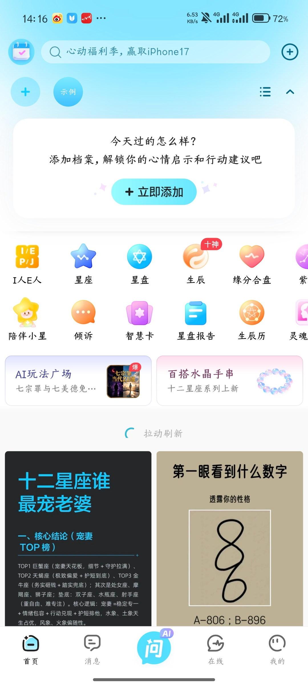
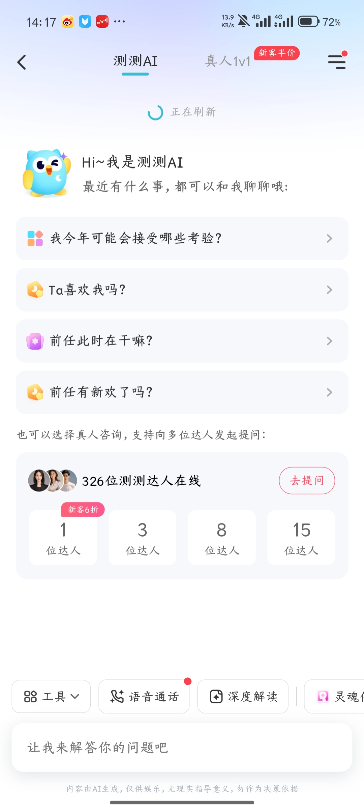
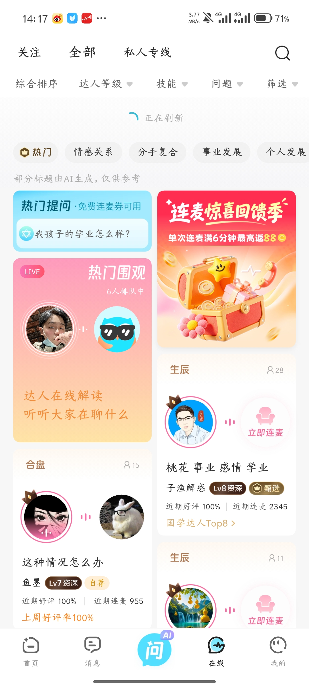
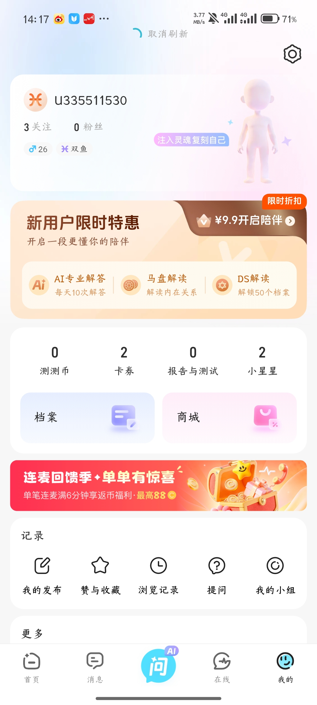

# App 全项目功能模块与后台管理需求清单

## 1. 文档说明

### 1.1 文档目的

本文基于现有 40 张 App 截图，对整个项目需要建设的功能模块进行统一整理，覆盖：

1. App 用户端；
2. 达人服务端能力；
3. 后端业务服务；
4. 运营管理后台；
5. 核心数据对象；
6. 跨模块业务流程；
7. 权限、安全、合规与非功能要求；
8. 分阶段建设建议。

本文是“功能模块总表”，用于确定产品范围和后续拆分 PRD、原型、接口、开发任务及测试用例，不替代每个模块的详细 PRD。

### 1.2 依据与标记

- **【已确认】**：截图或用户补充已经确认。
- **【必要能力】**：截图未展示，但要完成现有业务闭环必须建设。
- **【待定规则】**：存在功能入口，但具体业务规则仍需产品确认。

参考文档：

- [首页需求功能分析](首页需求功能分析.md)
- [问AI需求功能分析](问AI需求功能分析.md)
- [在线需求功能分析](在线需求功能分析.md)
- [我的需求功能分析](我的需求功能分析.md)

### 1.3 App 一级导航

App 一级导航共五项：**首页、消息、问AI、在线、我的**。

---

## 2. 产品角色

| 角色 | 主要权限和使用范围 |
|---|---|
| 游客 | 浏览允许公开展示的首页内容、玩法、话题和达人信息；需要登录的范围待定 |
| 注册用户 | 创建档案、使用 AI、发布互动、购买服务、进入在线房间、管理个人资料与资产 |
| 会员用户 | 使用会员专属价格、AI次数、档案数量、专属解读等权益 |
| 未成年人用户 | 受未成年人模式、支付、内容、互动和使用时长限制 |
| 真人达人 | 提供文字咨询、私聊、在线房间、公开连麦和私人专线服务 |
| 内容创作者 | 发布图文、参加话题、创建或上架 AI 玩法；是否与普通用户/达人重合待定 |
| 商家 | 管理商品、库存、订单、物流及售后；是否开放独立商家端待定 |
| 客服 | 处理用户反馈、咨询订单、充值、商城订单、退款、投诉和申诉 |
| 内容审核员 | 审核帖子、评论、话题、头像、昵称、AI生成内容和在线房间违规信息 |
| 运营人员 | 配置首页、活动、推荐、话题、卡券、签到、会员、玩法、商城和消息推送 |
| 财务人员 | 对账、退款、资产流水、达人结算、发票及异常订单处理 |
| 超级管理员 | 管理后台账号、角色、权限、系统配置及审计日志 |

---

## 3. App 用户端功能模块

## 3.1 公共基础模块

### APP-COM-01 账号与登录【必要能力】

- 手机号、验证码或第三方账号登录；具体登录方式待定；
- 注册、登录、退出登录；
- Token续期、设备管理、异地登录提醒；
- 登录态失效处理；
- 账号注销；
- 用户协议、隐私政策、充值协议、会员协议；
- 登录前后数据合并规则；
- 黑名单、封禁和账号恢复。

### APP-COM-02 页面导航【已确认】

- 五项底部导航；
- 返回、关闭、分享；
- 页面下拉刷新；
- 页面加载、空状态、失败状态和重试；
- 页面深链和分享回流【必要能力】。

### APP-COM-03 全局搜索【已确认/必要能力】

- 首页搜索；
- 在线达人/房间搜索；
- 档案搜索；
- 商城搜索；
- 消息搜索；
- 搜索建议、热门词、历史记录、清空历史；
- 综合结果和无结果状态；
- 搜索词审核及违规词拦截。

### APP-COM-04 分享【已确认/必要能力】

- 分享帖子、话题、档案结果、玩法、达人、在线房间、商城商品和心情日记；
- 生成分享卡片、链接或口令；
- 选择微信等渠道；
- 被分享用户的落地页和登录回流；
- 分享来源统计和活动归因。

### APP-COM-05 权限与设备能力【必要能力】

- 相机、相册、麦克风、通知、存储等权限申请；
- 拒绝、永久拒绝后的引导；
- 网络状态、弱网、断线重试；
- 前后台切换；
- 深色模式、语言、震动提醒；
- App版本检测与升级。

---

## 3.2 首页模块

### APP-HOME-01 首页聚合【已确认】

- 顶部签到入口；
- 搜索框及运营搜索词；
- 快捷添加菜单；
- 档案快捷选择区域；
- 档案今日摘要卡；
- 功能宫格；
- AI玩法广场和水晶手串横幅；
- 双列内容推荐流；
- 下拉刷新。

### APP-HOME-02 快捷添加【已确认】

- 邀请好友填档案；
- 添加档案；
- 邀请好友合盘；
- 分享邀请链接和被邀请方填写流程【必要能力】；
- 邀请记录、过期、撤回和隐私授权【必要能力】。

### APP-HOME-03 人物档案切换【已确认】

- 显示自己、示例和其他人物档案；
- 选择当前档案；
- 展开/收起档案区域；
- 人物入口展示不同人的档案；
- 特别关注档案；
- 无档案、单档案、多档案状态；
- 当前档案记忆规则【待定规则】。

### APP-HOME-04 新增/编辑档案【已确认】

- 粘贴自然语言并识别档案信息；
- 上传/选择头像；
- 昵称；
- 关系；
- 性别；
- 出生时间；
- 出生地点；
- 现居地；
- 出生地时区；
- 夏令时；
- 保存、校验、重复档案提醒；
- 编辑、删除、回收站恢复；
- 档案数量上限及会员扩容【待定规则】。

### APP-HOME-05 档案详情与每日信息【已确认】

- 日、周、月、年切换；
- 日期切换和回到今天；
- 查看星盘；
- 综合分；
- 爱情、财富、事业、学习、人际分数；
- 今日文案和分类提醒；
- 建议与避免；
- 幸运色、幸运配饰、幸运时辰、幸运方位等；
- 免费抽卡；
- 在线达人解读入口；
- 分享；
- 内容刷新时间和时区规则【待定规则】。

### APP-HOME-06 测算与工具宫格【已确认】

截图可见工具包括：

- I人/E人或人格类型；
- 星座；
- 星盘；
- 生辰/十神；
- 缘分合盘；
- 陪伴小星；
- 倾诉；
- 智慧卡；
- 星盘报告；
- 生辰历；
- 灵魂类工具；
- 其他横向扩展工具。

模块需支持工具排序、上下线、角标、收费方式、使用次数和人群展示配置【必要能力】。

### APP-HOME-07 签到与任务【已确认】

- 连续签到天数；
- 七日奖励；
- 签到规则和签到历史；
- 完成任务；
- 喂养精灵；
- 转盘抽奖；
- 达人提问券兑换；
- AI解答次数兑换；
- 小星星夺宝；
- 商城兑换；
- 签到成功、重复签到、补签、奖励到账和任务领取【必要能力】。

### APP-HOME-08 AI玩法广场【已确认】

- 热门、开学季、关注、上新、心动站等频道；
- 玩法搜索；
- 双列玩法卡片；
- 标题、副标题、封面、作者和热度；
- 互动视频类型；
- 玩法详情、使用、收藏、关注、分享和举报【必要能力】；
- 玩法发布/上架机制【必要能力】。

### APP-HOME-09 DIY水晶手串【已确认】

- 开始串珠；
- 灵感参考；
- 进入商城；
- 返回、关闭和分享；
- 珠子选择、搭配、预览、保存、生成商品和加入购物车【必要能力】；
- 定制信息与商城订单关联【必要能力】。

### APP-HOME-10 内容推荐流【已确认】

- 双列内容卡片；
- 下拉刷新和分页加载；
- 推荐、去重、曝光和点击；
- 图文/视频类型；
- 运营内容插入；
- 内容下架和不可见状态【必要能力】。

### APP-HOME-11 内容详情与互动【已确认】

- 作者信息、认证和标签；
- 关注；
- 图文正文；
- 点赞、评论、收藏和分享；
- 评论最热/最新排序；
- @用户和表情；
- 评论空状态；
- 举报、拉黑、不感兴趣和删除【必要能力】。

### APP-HOME-12 话题【已确认】

- 话题封面、名称、简介；
- 内容数、热度；
- 关注、收藏和分享；
- 精选/最新内容；
- 参与话题；
- 话题内容分页和空状态；
- 话题搜索、推荐和举报【必要能力】。

### APP-HOME-13 内容发布【已确认】

- 添加图片；
- 标题和正文；
- 预置、添加和移除话题；
- AI生成内容声明；
- 发布；
- 草稿、退出提醒、图片数量、字数和格式校验【必要能力】；
- 发布成功、审核中、审核失败和违规提示【必要能力】。

---

## 3.3 消息模块

### APP-MSG-01 消息首页【已确认】

- 消息列表；
- 下拉刷新；
- 搜索消息；
- 清理/管理消息入口；
- 消息时间、摘要和未读状态【必要能力】；
- 消息置顶、删除、标记已读、全部已读【必要能力】。

### APP-MSG-02 分身雷达【已确认】

- “发现和你同频的人”入口；
- 推荐用户/AI分身列表【必要能力】；
- 进入个人主页或发起交流【必要能力】；
- 推荐依据、隐私授权和关闭推荐【待定规则】。

### APP-MSG-03 系统通知【已确认】

- 券到账、资产变化、订单、账号和服务通知；
- 通知列表与详情【必要能力】；
- 未读数、跳转目标、失效目标处理【必要能力】。

### APP-MSG-04 活动通知【已确认】

- 活动解锁、奖励和运营消息；
- 活动详情跳转；
- 消息有效期和下线提示【必要能力】。

### APP-MSG-05 私信与咨询消息【必要能力】

- 用户与达人私聊；
- 咨询订单消息；
- 文本、图片、表情、系统卡片和订单卡片；
- 发送状态、失败重试、已读回执；
- 举报、拉黑、删除会话；
- 历史消息分页。

### APP-MSG-06 系统通知权限引导【已确认】

- 检测系统通知开关；
- 引导用户前往系统设置开启；
- 关闭当前引导；
- 开启后的状态同步。

---

## 3.4 问AI模块

### APP-AI-01 测测AI首页【已确认】

- AI欢迎语；
- 动态推荐问题；
- 下拉刷新；
- 自定义问题输入；
- AI内容免责声明；
- 问题推荐基于档案/历史的规则【待定规则】。

### APP-AI-02 AI对话【必要能力】

- 新建、继续和删除对话；
- 文本输入与发送；
- 流式回答；
- 停止生成、重新生成、复制和分享；
- 上下文记忆；
- 选择人物档案；
- 引用星盘、合盘、生辰、星骰、智慧卡等工具结果；
- 次数/测测币/会员额度扣减；
- 敏感内容拦截；
- 回答失败、超时和重试。

### APP-AI-03 AI工具栏【已确认/必要能力】

- 工具下拉；
- 语音通话；
- 深度解读；
- 灵魂伴侣等扩展工具；
- 工具选择、参数填写、结果卡片和历史记录；
- 麦克风权限、语音识别、音频播放和中断。

### APP-AI-04 真人咨询快捷入口【已确认】

- 在线达人数；
- 去提问；
- 向1、3、8、15位达人提问；
- 新客折扣；
- 多达人提问的报价、分发、应答和结果聚合【待定规则】。

### APP-AI-05 真人达人列表【已确认】

- 综合排序；
- 按工具筛选；
- 新客半价和快速响应；
- 达人在线状态；
- 好评率、累计咨询量；
- 推荐/评价摘要和榜单；
- 服务标签、IP地区和咨询价格；
- 分页、空结果和达人离线状态【必要能力】。

### APP-AI-06 达人个人主页【已确认】

- 头像、昵称、认证、等级、粉丝；
- 关注；
- 职业、地区、徽章；
- 好评率、评价数、服务时长和服务次数；
- 简介、咨询、动态标签；
- 兴趣特长、沟通风格和个人介绍；
- 私聊、文字沟通及优惠券提示。

### APP-AI-07 达人私聊【已确认】

- 欢迎语；
- 优惠券提示；
- 用户留言；
- 1v1提问卡片；
- 合盘、星盘、星骰、智慧卡快捷工具；
- 400字输入限制；
- 更多菜单；
- 消息发送、达人回复、举报和拉黑【必要能力】。

### APP-AI-08 文字咨询下单【已确认】

- 达人信息和评价摘要；
- 文字/语音服务类型；
- 合盘、星盘、星骰、智慧卡工具；
- 200字问题；
- 选择档案；
- 支付宝、测测币、卡券；
- 会员价与立即购买；
- 订单确认、支付结果、达人接单、答复、评价、退款和申诉【必要能力】。

---

## 3.5 在线模块

### APP-LIVE-01 在线首页【已确认】

- 关注、全部、私人专线频道；
- 搜索；
- 综合排序、达人等级、技能、问题和筛选；
- 热门、情感关系、分手复合、事业发展、个人发展等分类；
- 下拉刷新；
- 房间流分页。

### APP-LIVE-02 在线运营位【已确认】

- 热门提问；
- 免费连麦券提示；
- 连麦活动横幅；
- 热门围观；
- 新人券到期浮层；
- 立即使用和关闭。

### APP-LIVE-03 房间卡片【已确认】

- 服务类型、房间人数；
- 达人与连麦用户头像；
- 音频状态；
- 立即连麦；
- 问题标题；
- 达人等级、精选、自荐和榜单；
- 好评率和近期连麦量；
- 免费券或限时免费。

### APP-LIVE-04 在线房间【已确认】

- 达人信息、关注数和人气；
- 关注；
- 网络状态；
- 分享、缩放/全屏、关闭；
- 更多在线；
- 达人与连麦用户信息；
- 麦序；
- 公告、免责声明和欢迎语；
- 用户进房提示；
- 房间文字消息；
- 礼物、优惠券；
- 生辰、图片等工具；
- 私人专线与公开连麦。

### APP-LIVE-05 公开连麦【必要能力】

- 申请连麦；
- 麦克风权限；
- 选择问题/工具/档案；
- 使用连麦券或测测币；
- 排队、麦序、叫号；
- 接通、计时、扣费；
- 静音、挂断、断线重连；
- 达人拒绝、用户取消、超时；
- 连麦结束、评价和投诉。

### APP-LIVE-06 私人专线【必要能力】

- 私人通话申请；
- 达人忙碌/空闲状态；
- 价格和优惠确认；
- 接通、计时和扣费；
- 隐私提示；
- 结束、评价、退款和申诉；
- 私人内容是否对房间其他用户可见/可听【待定规则】。

### APP-LIVE-07 房间互动与治理【必要能力】

- 关注达人；
- 发言、表情、礼物；
- 进入/离开提示；
- 禁言、踢出、举报、拉黑；
- 房主/达人管理连麦队列；
- 房间关闭与异常断开；
- 内容安全提示和录音/回放规则【待定规则】。

---

## 3.6 我的模块

### APP-ME-01 我的首页【已确认】

- 用户头像、用户编号/昵称；
- 关注、粉丝；
- 性别、年龄、星座；
- 3D人物；
- 注入灵魂复刻自己；
- 设置；
- 会员权益；
- 测测币、卡券、报告与测试、小星星；
- 档案、商城；
- 我的发布、赞与收藏、浏览记录、提问、我的小组；
- 更多区域及心情日记；
- 下拉刷新。

### APP-ME-02 个人资料与社交关系【必要能力】

- 修改头像、昵称、性别、生日、地区和简介；
- 用户主页；
- 关注/取消关注；
- 关注列表和粉丝列表；
- 黑名单；
- 3D人物创建、编辑和展示；
- AI分身创建、授权、删除和隐私设置。

### APP-ME-03 会员中心【已确认/必要能力】

- 新用户限时优惠；
- 9.9元开启陪伴；
- AI专业解答次数；
- 马盘解读；
- DS解读与档案数量权益；
- 会员套餐、订阅、续费、到期、恢复购买和取消自动续费；
- 会员价格、权益使用记录和失效提醒。

### APP-ME-04 心情日记【已确认】

- 从“更多”区域进入；
- 月历、日期选择和月份切换；
- 最多选择2个心情；
- 最多选择3个原因；
- 45字补充；
- 保存、编辑、删除、历史和分享【必要能力】。

### APP-ME-05 我的发布【已确认】

- 发布内容列表；
- 浏览量；
- 分享、评论、点赞；
- 更多菜单；
- 新增发布；
- 编辑、删除、审核状态和违规申诉【必要能力】。

### APP-ME-06 赞与收藏【已确认】

- 赞/收藏切换；
- 动态/AI玩法切换；
- 空状态和有数据列表；
- 取消赞、取消收藏和失效内容处理【必要能力】。

### APP-ME-07 浏览记录【已确认入口/必要能力】

- 按时间展示浏览过的帖子、玩法、达人或商品；
- 删除单条、清空全部；
- 隐私开关和保存周期【待定规则】。

### APP-ME-08 我的提问【已确认】

- 问一问、1v1提问、智能体标签；
- 按解答方式、时间和工具筛选；
- 搜索；
- 空状态和热门问题；
- 提问记录、订单状态、答案详情、评价和删除【必要能力】。

### APP-ME-09 我的小组【已确认】

- 空状态；
- 已加入/创建的小组列表【必要能力】；
- 小组详情、成员、内容、加入、退出和管理【必要能力】。

### APP-ME-10 我的档案【已确认】

- 搜索；
- 按关系、昵称排序和筛选；
- 微信邀请；
- 新增档案；
- 自己、特别关注等分组；
- 编辑、特别关注；
- 点击头像复刻AI分身；
- 档案回收站；
- 恢复和彻底删除【必要能力】。

### APP-ME-11 我的小星星【已确认】

- 小星星余额；
- 获取/消耗记录；
- 小星星活动、商城、获取任务；
- 夺宝和转盘抽奖；
- 兑换确认、中奖、发奖、余额不足和活动规则【必要能力】。

### APP-ME-12 已购买【已确认】

- 从“报告与测试”进入；
- 默认显示“我的报告”；
- 我的报告/我的测试；
- 空状态推荐；
- 报告预览；
- 已购买列表、内容阅读、恢复购买和失效处理【必要能力】。

### APP-ME-13 我的卡券【已确认】

- 全部、连麦券、新手体验券、兑换券；
- 帮助和使用记录；
- 有效期、面额/时长、使用条件和去使用；
- 精选券包购买；
- 过期、已使用、冻结、退回和不可用状态【必要能力】。

### APP-ME-14 我的测测币【已确认】

- 总余额、可用余额、冻结余额；
- 资产记录；
- 充值档位；
- 支付宝、微信支付；
- 充值协议；
- 立即充值；
- 充值成功、失败、取消、到账延迟和退款【必要能力】。

### APP-ME-15 设置【已确认/必要能力】

- 个人资料；
- 账号安全；
- 免密支付；
- 通知设置；
- 隐私设置；
- 语言设置；
- 智能体设置；
- 黑名单；
- 未成年人模式；
- 夜间模式；
- 震动提醒；
- 清理缓存、版本、关于、协议、退出登录和注销账号【必要能力】。

---

## 3.7 商城与实物交易模块

### APP-MALL-01 商城首页【已确认】

- 搜索、轮播横幅；
- 分类标签；
- 双列商品列表；
- 商品标题、简介、价格、划线价和店铺；
- 加入购物车；
- 分享、客服；
- 商城首页、分类、购物车、我的。

### APP-MALL-02 商品与购物车【必要能力】

- 商品详情、图文详情和规格SKU；
- 库存、限购和上下架；
- 收藏、分享和客服；
- 加入购物车、修改数量和删除；
- DIY定制信息关联商品。

### APP-MALL-03 订单与履约【必要能力】

- 收货地址；
- 订单确认；
- 优惠、运费和实付金额；
- 支付；
- 待付款、待发货、待收货、已完成、已取消；
- 物流查询和确认收货；
- 退款、退货、售后和客服。

---

## 4. 后端业务服务模块

后端服务是支撑 App 和管理后台的业务能力，不等同于后台管理页面。

| 服务编号 | 服务模块 | 核心职责 |
|---|---|---|
| SVC-01 | 认证与账号服务 | 注册登录、Token、设备、账号状态、注销、黑名单 |
| SVC-02 | 用户与社交关系服务 | 用户资料、关注、粉丝、用户主页、隐私关系 |
| SVC-03 | 人物档案服务 | 档案CRUD、关系、出生信息、时区、特别关注、回收站、邀请 |
| SVC-04 | 星盘/生辰计算服务 | 星盘、生辰、合盘、日周月年计算、评分和幸运信息 |
| SVC-05 | 解读内容服务 | 解读模板、报告生成、版本管理、购买授权和内容交付 |
| SVC-06 | AI编排服务 | 模型调用、智能体、提示词、工具调用、上下文、流式回答和限额 |
| SVC-07 | AI安全服务 | 输入输出审核、敏感主题、免责声明、人工复核和风险日志 |
| SVC-08 | 内容社区服务 | 帖子、话题、评论、点赞、收藏、关注、发布、草稿和审核状态 |
| SVC-09 | 媒体服务 | 图片/视频上传、压缩、转码、鉴黄、存储和CDN |
| SVC-10 | 搜索服务 | 内容、话题、达人、档案、消息、玩法和商品搜索 |
| SVC-11 | 推荐服务 | 首页内容、热门问题、达人、玩法、话题和商品推荐 |
| SVC-12 | 达人服务 | 达人资料、认证、等级、标签、排班、在线状态、价格和评价 |
| SVC-13 | 咨询订单服务 | 文字咨询、语音咨询、多达人提问、接单、完成、评价和售后 |
| SVC-14 | 即时消息服务 | 私信、咨询会话、系统卡片、消息状态、历史记录和未读数 |
| SVC-15 | 在线房间服务 | 房间生命周期、在线人数、进出房、公告、礼物和房间治理 |
| SVC-16 | 实时音视频服务 | 麦克风、连麦、排队、麦序、计时、断线重连和通话质量 |
| SVC-17 | 资产账户服务 | 测测币、小星星、冻结/解冻、账本、扣减和幂等处理 |
| SVC-18 | 支付服务 | 支付宝、微信支付、回调、退款、对账和支付异常 |
| SVC-19 | 卡券服务 | 发券、领券、券包、核销、退回、过期和适用范围 |
| SVC-20 | 会员服务 | 套餐、订阅、权益、次数、会员价、续费和到期 |
| SVC-21 | 活动任务服务 | 签到、任务、转盘、夺宝、奖励、活动资格和防刷 |
| SVC-22 | 商城服务 | 商品、SKU、库存、购物车、订单、物流和售后 |
| SVC-23 | 消息通知服务 | 站内信、系统通知、活动通知、Push、短信及模板 |
| SVC-24 | 运营配置服务 | 首页、宫格、横幅、频道、热搜、推荐位和灰度配置 |
| SVC-25 | 风控服务 | 账号、支付、活动、刷券、刷奖励、欺诈和异常设备识别 |
| SVC-26 | 客服工单服务 | 用户反馈、投诉、退款、申诉、证据和处理记录 |
| SVC-27 | 数据埋点与指标服务 | 曝光、点击、转化、留存、订单、收入、AI成本和RTC质量 |
| SVC-28 | 定时任务服务 | 内容刷新、券过期、会员到期、结算、发奖、通知和数据汇总 |

---

## 5. 运营管理后台模块

## 5.1 后台基础与权限

### ADM-01 后台登录与组织权限【必要能力】

- 管理员登录、验证码和二次验证；
- 组织、部门、岗位；
- 角色和菜单权限；
- 数据范围权限；
- 敏感操作二次确认；
- 登录日志、操作日志和导出日志；
- IP白名单和会话超时。

### ADM-02 管理驾驶舱【必要能力】

- 新增用户、活跃用户、留存；
- AI提问量、成功率、平均耗时和成本；
- 达人在线、咨询订单、连麦时长；
- 充值、消费、退款和收入；
- 内容发布、互动、审核和举报；
- 商城订单、成交额和售后；
- 异常告警和待办事项。

## 5.2 用户、账号与档案管理

### ADM-USER-01 用户管理【必要能力】

- 用户列表、搜索和筛选；
- 用户详情、账号状态和设备；
- 关注、粉丝、发布、提问、订单和资产概览；
- 封禁、解封、禁言、限制支付和限制互动；
- 实名/年龄/未成年人状态；
- 注销申请和数据删除；
- 用户数据导出需受权限控制。

### ADM-USER-02 人物档案管理【必要能力】

- 查询用户档案数量和状态；
- 查看档案基础字段和来源；
- 处理重复、异常、删除和恢复；
- 示例档案配置；
- 档案上限和会员扩容规则；
- 出生信息、位置等敏感字段脱敏；
- AI分身授权和撤销记录。

### ADM-USER-03 用户反馈与客服视图【必要能力】

- 查看用户提交的问题；
- 关联账号、订单、资产流水、会话和设备日志；
- 创建、分派、处理、升级和关闭工单；
- 用户回复、内部备注和附件；
- SLA和满意度。

## 5.3 达人与服务管理

### ADM-EXPERT-01 达人入驻与认证【必要能力】

- 入驻申请；
- 身份、资质和材料审核；
- 认证标识、职业、地区和擅长工具；
- 通过、驳回、补材料和冻结；
- 合同、协议和结算账户。

### ADM-EXPERT-02 达人资料与等级【必要能力】

- 资料、简介、沟通风格和兴趣标签；
- 等级、徽章、精选、自荐和榜单；
- 好评率、服务时长、服务次数；
- 粉丝、推荐人数和评价；
- 指标口径及人工调整权限。

### ADM-EXPERT-03 服务商品与价格【必要能力】

- 文字沟通、语音沟通、公开连麦、私人专线等服务；
- 定价、会员价、新客价和起购门槛；
- 支持的星盘/合盘/生辰/智慧卡等工具；
- 可用卡券和优惠；
- 服务上下架、排班和暂停接单。

### ADM-EXPERT-04 达人结算【必要能力】

- 收入明细；
- 平台抽佣；
- 可结算、冻结和已结算金额；
- 结算周期和提现；
- 退款冲销、争议款和税务资料；
- 对账单导出。

## 5.4 AI与测算能力管理

### ADM-AI-01 模型与供应商配置【必要能力】

- 模型供应商、模型版本和路由；
- 超时、重试、限流和降级；
- Token成本、调用量和失败率；
- 灰度发布和回滚；
- 密钥仅由安全配置管理，不在页面明文展示。

### ADM-AI-02 智能体与提示词【必要能力】

- 智能体列表、角色和头像；
- 系统提示词、欢迎语和推荐问题；
- 工具权限；
- 知识库与引用资料；
- 版本、测试、审批、发布和回滚；
- 不同用户、会员和渠道的配置。

### ADM-AI-03 AI工具配置【必要能力】

- 星盘、合盘、生辰、星骰、智慧卡等工具注册；
- 输入参数、输出格式和收费方式；
- 可用场景、每日次数和会员权益；
- 工具故障熔断和维护提示。

### ADM-AI-04 AI安全与质量【必要能力】

- 敏感词和风险类别；
- 输入、输出审核；
- 医疗、法律、财务、自伤等高风险提示；
- AI生成标识；
- 低质量回答反馈和人工复核；
- 会话抽检、质量评分和申诉；
- 用户隐私数据在模型调用中的脱敏策略。

### ADM-CALC-01 星盘与解读配置【必要能力】

- 计算规则版本；
- 日/周/月/年评分配置；
- 爱情、财富、事业、学习、人际维度；
- 解读文案模板；
- 建议、避免、幸运信息；
- 报告模板、预览、价格和解锁；
- 版本发布、灰度和历史结果兼容。

## 5.5 内容、话题与玩法管理

### ADM-CONTENT-01 内容审核【必要能力】

- 帖子、评论、图片、视频、标题、昵称和头像审核；
- 机审、人工复审和抽检；
- 待审、通过、驳回、下架和删除；
- 违规原因、用户通知和申诉；
- AI生成内容标识核验；
- 批量处理和审核日志。

### ADM-CONTENT-02 帖子与评论管理【必要能力】

- 内容搜索、筛选、查看和下架；
- 评论层级、热度和排序；
- 推荐、置顶、加精和屏蔽；
- 举报、处理结果和用户处罚；
- 曝光、浏览、点赞、收藏、评论和分享数据。

### ADM-CONTENT-03 话题管理【必要能力】

- 话题创建、编辑、合并、上下线；
- 封面、简介和运营标签；
- 精选/最新规则；
- 话题热度和内容数；
- 参与权限、主持人和违规治理；
- 话题推荐位。

### ADM-CONTENT-04 AI玩法广场【必要能力】

- 玩法创建、审核、上架和下架；
- 频道与标签；
- 封面、标题、副标题、作者和类型；
- 热度、排序、关注和推荐；
- 互动视频内容管理；
- 使用量、完成率、分享率和成本。

### ADM-CONTENT-05 小组管理【必要能力】

- 小组创建、审核、封面、简介和成员；
- 加入方式、管理员和成员权限；
- 小组内容审核；
- 解散、封禁和申诉。

## 5.6 首页与运营配置

### ADM-OPS-01 首页装修【必要能力】

- 搜索运营词；
- 功能宫格排序、图标、角标和跳转；
- 横幅、活动位和推荐位；
- 内容流插入位；
- 生效时间、目标人群、版本和渠道；
- 预览、灰度、发布和回滚。

### ADM-OPS-02 搜索与热榜【必要能力】

- 推荐搜索词；
- 热门内容排行；
- 新内容标记；
- 词条上下线、排序和有效期；
- 搜索联想和违禁词；
- 搜索无结果推荐。

### ADM-OPS-03 推荐运营【必要能力】

- 首页内容、达人、房间、玩法、话题、报告和商品推荐；
- 人工置顶和算法推荐；
- 人群、地域、时间和会员定向；
- 去重、频控和兜底池；
- 曝光点击和转化数据。

### ADM-OPS-04 签到与任务【必要能力】

- 七日奖励模板；
- 连续签到、补签和重置规则；
- 任务类型、完成条件和奖励；
- 转盘奖池、夺宝和兑换；
- 参与资格、库存、概率和中奖记录；
- 防刷、黑名单和人工补发。

### ADM-OPS-05 活动管理【必要能力】

- 活动创建、规则、页面和素材；
- 开始/结束时间；
- 目标人群；
- 奖励、券和测测币；
- 活动通知；
- 活动数据、预算和异常告警。

## 5.7 在线房间与实时服务管理

### ADM-LIVE-01 房间管理【必要能力】

- 在线房间列表；
- 房主/达人、主题、人数和状态；
- 房间公告、背景和分类；
- 开房、关房、暂停和强制关闭；
- 实时查看连麦、麦序和异常；
- 房间推荐、热门围观和精选标识。

### ADM-LIVE-02 连麦管理【必要能力】

- 公开连麦和私人专线订单；
- 申请、排队、叫号、接通、挂断和取消；
- 通话时长、计费和券使用；
- 断线、失败和补偿；
- 音质、延迟、丢包和崩溃数据；
- 争议录音/日志的合规保存策略。

### ADM-LIVE-03 房间治理【必要能力】

- 房间巡检；
- 用户禁言、踢出和封禁；
- 达人停播和处罚；
- 敏感语音识别与告警；
- 举报、证据、复核和申诉；
- 房间黑名单。

### ADM-LIVE-04 礼物与房间道具【必要能力】

- 礼物配置、价格和动画素材；
- 生辰、图片等房间工具；
- 赠送流水、撤销/退款规则；
- 达人分成和活动礼物。

## 5.8 订单、支付与资产管理

### ADM-ORDER-01 咨询订单【必要能力】

- 文字、语音、多达人提问和在线连麦订单；
- 待支付、已支付、待接单、服务中、已完成、已取消、退款中和已退款；
- 服务内容、档案、工具、达人和价格；
- 超时、取消、补偿和人工完结；
- 评价、投诉和申诉。

### ADM-PAY-01 支付与退款【必要能力】

- 支付宝、微信支付；
- 支付单、渠道单号和回调；
- 支付异常、重复回调和补单；
- 全额/部分退款；
- 日对账和差异处理；
- 退款权限和审批。

### ADM-ASSET-01 测测币账户【必要能力】

- 用户余额、可用、冻结；
- 充值、赠送、消费、退款和调整；
- 资产流水；
- 人工加减需审批和审计；
- 异常冻结、解冻和余额校正。

### ADM-ASSET-02 小星星账户【必要能力】

- 获取、消耗、冻结、过期和补发；
- 任务、签到、活动、转盘和兑换来源；
- 流水查询；
- 防刷和异常扣回。

### ADM-ASSET-03 卡券管理【必要能力】

- 券模板、券包和批次；
- 连麦券、新手体验券、兑换券、1v1券；
- 面额、时长、门槛、范围、有效期；
- 领取、发放、核销、锁定、退回和过期；
- 用户券查询和人工补券；
- 发券预算及防刷。

### ADM-MEMBER-01 会员管理【必要能力】

- 会员套餐、价格和有效期；
- 权益项和次数；
- 新客优惠、续费和自动续费；
- 会员订单、退款和恢复购买；
- 会员用户查询和人工调整。

## 5.9 商城后台

### ADM-MALL-01 商品与类目【必要能力】

- 类目、品牌、店铺；
- 商品、SKU、图片、详情、价格和划线价；
- DIY定制商品参数；
- 库存、上下架、限购和预售；
- 搜索词和商品推荐。

### ADM-MALL-02 商城订单【必要能力】

- 订单列表与详情；
- 收货地址、商品、金额、优惠和支付；
- 发货、物流、确认收货和取消；
- 备注和订单导出；
- 异常订单处理。

### ADM-MALL-03 售后与客服【必要能力】

- 退款、退货、换货和补发；
- 定制商品售后规则；
- 用户举证、商家处理和平台仲裁；
- 售后时效和退款流水。

## 5.10 消息与通知后台

### ADM-MSG-01 消息模板【必要能力】

- 系统通知、活动通知、订单通知和资产通知模板；
- 标题、摘要、正文、图片和跳转；
- 多语言；
- 审核、测试发送和版本管理。

### ADM-MSG-02 消息任务【必要能力】

- 立即/定时发送；
- 全量、分群和单用户发送；
- Push、站内信、短信等渠道；
- 频控、免打扰和失败重试；
- 送达、点击和转化统计；
- 撤回与失效。

## 5.11 风控、合规与审核

### ADM-RISK-01 内容与互动风控【必要能力】

- 文本、图片、视频和语音审核；
- 垃圾信息、广告、欺诈和引流识别；
- 敏感词、黑白名单和处罚规则；
- 用户举报、复核和申诉；
- 达人和房间风险分级。

### ADM-RISK-02 交易与活动风控【必要能力】

- 盗刷、异常充值、异常退款；
- 批量注册、刷签到、刷券、刷奖励；
- 设备、IP、支付账户和行为关联；
- 风险订单拦截和人工审核。

### ADM-RISK-03 隐私与数据合规【必要能力】

- 出生日期、出生地点、现居地等敏感数据分级；
- 数据采集授权；
- 用户数据查询、更正、导出和删除；
- AI模型调用数据脱敏；
- 未成年人模式；
- 数据访问审计和保留周期；
- 第三方支付、推送、RTC和模型供应商清单。

## 5.12 数据分析后台

### ADM-DATA-01 用户与增长【必要能力】

- 新增、活跃、留存、回流；
- 注册、建档、首问、首购、首充转化；
- 渠道、版本、地域和用户分群；
- 会员转化和续费。

### ADM-DATA-02 内容与社区【必要能力】

- 内容曝光、点击、阅读完成；
- 发布、审核、点赞、评论、收藏和分享；
- 话题参与和关注；
- 推荐位效果和负反馈。

### ADM-DATA-03 AI与工具【必要能力】

- 提问量、回答成功率、耗时；
- 模型Token和成本；
- 工具使用、完成率和付费转化；
- 用户反馈、重新生成和风险拦截；
- 各智能体和提示词版本效果。

### ADM-DATA-04 达人与在线【必要能力】

- 达人在线时长、响应率、接单率；
- 咨询量、完成率、好评率和退款率；
- 房间UV、停留、连麦申请和接通率；
- 麦序等待时长、通话时长和RTC质量；
- 达人收入和平台抽佣。

### ADM-DATA-05 交易与商城【必要能力】

- 充值、消费、退款和余额；
- 会员、咨询、卡券、报告、活动和商城收入；
- 商品浏览、加购、支付和成交；
- 订单、客单价、复购、物流和售后。

---

## 6. 核心数据对象

| 领域 | 核心对象 |
|---|---|
| 用户 | 用户、账号、设备、登录会话、用户资料、关注关系、黑名单 |
| 档案 | 人物档案、关系、出生信息、地点、时区、特别关注、回收站、邀请 |
| 测算 | 星盘、生辰、合盘、每日分数、幸运信息、解读模板、报告、测试 |
| AI | 智能体、模型、提示词、工具、会话、消息、调用记录、额度、反馈 |
| 内容 | 帖子、媒体、话题、评论、点赞、收藏、关注、举报、审核记录 |
| 达人 | 达人、资质、等级、徽章、标签、排班、服务商品、价格、评价 |
| 咨询 | 咨询订单、问题、档案引用、工具、接单、答案、评价、退款、申诉 |
| 在线 | 房间、房间成员、麦序、连麦申请、RTC会话、计时、礼物、处罚 |
| 资产 | 测测币账户、冻结金额、资产流水、小星星账户、卡券、会员权益 |
| 支付 | 业务订单、支付单、渠道流水、退款单、对账单、达人结算单 |
| 活动 | 活动、签到、任务、奖池、中奖记录、发奖记录、兑换记录 |
| 商城 | 店铺、类目、商品、SKU、库存、购物车、地址、订单、物流、售后 |
| 消息 | 会话、消息、系统通知、活动通知、Push任务、消息模板、未读数 |
| 日记 | 心情日记、心情标签、原因标签、日期和分享记录 |
| 后台 | 管理员、组织、角色、权限、审批、操作日志、配置版本 |

所有涉及金额、测测币、小星星、卡券和会员次数的变动必须使用不可篡改的流水记录，并支持业务单据追溯。

---

## 7. 关键业务流程

### 7.1 建档与每日解读

用户新增档案 → 校验时间/地点/时区 → 生成基础盘 → 生成日周月年数据 → 首页展示 → 进入详情 → 抽卡/在线解读/购买报告。

### 7.2 AI问答

选择推荐问题或输入问题 → 选择档案/工具 → 校验会员次数或资产 → 内容安全检查 → AI生成 → 展示答案 → 扣减额度 → 收藏/分享/追问 → 记录到“我的提问”。

### 7.3 真人文字咨询

选择达人 → 查看主页 → 选择服务工具 → 输入问题 → 选择档案 → 选择卡券/支付方式 → 支付 → 达人接单 → 沟通/回答 → 完成 → 评价 → 退款或申诉。

### 7.4 在线公开连麦

进入房间围观 → 申请连麦 → 选择档案/工具/券 → 权限检测 → 进入麦序 → 达人接通 → 计时扣费 → 结束 → 评价/投诉 → 订单与资产流水落账。

### 7.5 私人专线

选择达人私人专线 → 校验达人状态 → 确认价格和优惠 → 支付或预冻结 → 建立私密会话 → 计时扣费 → 结束结算 → 评价/退款/申诉。

### 7.6 内容发布

编辑图文 → 添加话题 → 声明AI生成内容 → 提交 → 机器审核 → 必要时人工审核 → 发布 → 推荐分发 → 点赞/评论/收藏/分享 → 举报/下架/申诉。

### 7.7 充值与资产消费

选择充值档位 → 同意协议 → 选择支付方式 → 第三方支付 → 回调校验 → 测测币到账 → 生成账本流水 → 消费时冻结/扣减 → 退款时原路或资产退回。

### 7.8 商城订单

浏览商品 → 选择SKU/定制信息 → 加入购物车 → 确认地址和优惠 → 支付 → 商家发货 → 物流 → 收货 → 评价/售后。

### 7.9 运营内容发布

运营创建配置 → 选择位置、人群和时间 → 预览 → 审核 → 灰度 → 正式发布 → 数据监控 → 下线或回滚。

---

## 8. 后台角色权限建议

| 功能域 | 运营 | 内容审核 | 达人运营 | 客服 | 财务 | 风控 | 超管 |
|---|---:|---:|---:|---:|---:|---:|---:|
| 首页/活动配置 | 写 | 读 | 读 | 读 | 无 | 读 | 全部 |
| 内容与话题 | 写 | 审核 | 读 | 读 | 无 | 处罚 | 全部 |
| 用户资料 | 脱敏读 | 脱敏读 | 脱敏读 | 受限读 | 无 | 受限读 | 全部 |
| 达人资料 | 读 | 审核内容 | 写 | 读 | 读 | 处罚 | 全部 |
| 咨询/连麦订单 | 读 | 受限读 | 写 | 处理 | 读 | 受限读 | 全部 |
| 测测币/退款 | 统计 | 无 | 只读 | 发起申请 | 审批/执行 | 受限读 | 全部 |
| 卡券/活动奖励 | 写 | 无 | 读 | 补发申请 | 审批 | 风控 | 全部 |
| 商城订单 | 运营 | 审核商品 | 无 | 售后处理 | 对账 | 风控 | 全部 |
| AI配置 | 受限写 | 安全审核 | 读 | 只读 | 成本读 | 风险配置 | 全部 |
| 系统权限与日志 | 无 | 无 | 无 | 无 | 无 | 只读 | 全部 |

涉及余额调整、退款、补券、封禁、内容强制下架、达人结算和系统配置发布的操作，应采用审批或至少二次确认，并记录操作前后值。

---

## 9. 非功能要求

### 9.1 安全

- 登录和支付链路全程加密；
- 敏感数据加密存储；
- 后台最小权限和数据脱敏；
- 防越权、重放、重复扣费和接口刷量；
- 支付回调验签和订单幂等；
- 管理员操作审计。

### 9.2 隐私与合规

- 明示收集出生日期、地点、现居地、语音、图片的用途；
- 支持授权撤回、账号注销和数据删除；
- AI生成内容明确提示仅供娱乐参考；
- 真人咨询、在线房间和录音规则明确告知；
- 未成年人模式限制支付、连麦、内容和使用时段；
- 第三方SDK清单和隐私政策保持一致。

### 9.3 性能与稳定性

- 首页、消息、问AI、在线、我的首屏性能指标；
- 内容流分页和图片懒加载；
- AI流式响应及超时降级；
- RTC弱网、断线重连和质量监控；
- 支付、资产和订单服务高可用；
- 核心任务失败重试和告警。

### 9.4 数据一致性

- 支付、充值、测测币、卡券、小星星和会员权益保持账实一致；
- 咨询计时与扣费可追溯；
- 订单状态机不可越级；
- 退款、取消和补偿使用幂等键；
- 对账差异可人工处理并留痕。

### 9.5 内容与AI质量

- 内容机审与人工审核；
- AI输入输出安全拦截；
- 模型、提示词、测算规则和报告模板版本化；
- 结果可追溯到使用的版本；
- 支持灰度、回滚和质量反馈。

### 9.6 可用性与无障碍

- 关键按钮具备明确文字或可访问标签；
- 颜色不是唯一状态表达；
- 字体缩放、对比度和点击区域满足移动端基本要求；
- 输入错误提供明确提示；
- 加载、空、失败、权限拒绝和无网络状态一致。

---

## 10. 仍需产品确定的关键规则

以下问题不会阻止模块划分，但会影响详细PRD、数据库和订单状态机：

1. 游客可访问范围和各功能的登录拦截点；
2. 档案数量上限、会员扩容、示例档案和AI分身授权；
3. 每日分数、解读和推荐内容的刷新时间及计算版本；
4. AI免费次数、测测币扣费、会员额度和失败返还；
5. 向1/3/8/15位达人提问的分发、报价和答复聚合；
6. 达人私聊、文字沟通、语音沟通的收费与接单规则；
7. 在线房间“麦序”的精确定义；
8. 公开连麦和私人专线的隐私、排队、计费和中断规则；
9. 达人抽佣、结算周期、退款责任和争议处理；
10. 卡券叠加、退回、过期和适用服务；
11. 小星星与测测币能否互换及各自有效期；
12. 会员订阅周期、自动续费和权益失效；
13. 内容审核时效、处罚等级和申诉机制；
14. 商城是平台自营、商家入驻还是混合模式；
15. 定制水晶商品的生产周期、退款和售后规则；
16. AI/真人咨询内容保存周期及用户删除权；
17. 在线房间语音是否录制以及争议证据保存时间；
18. 未成年人模式的开启、验证和监护人控制方式。

---

## 11. 建设优先级建议

### P0：基础与交易安全

- 账号、用户、档案；
- 支付、订单、测测币账本、卡券；
- 权限、隐私、审核、日志、风控；
- 消息通知；
- 后台账号和角色权限；
- 埋点、监控和告警。

### P1：核心业务闭环

- 首页档案与每日解读；
- AI问答和工具调用；
- 真人达人列表、主页、文字咨询；
- 在线房间、公开连麦、私人专线；
- 内容发布、话题、评论和互动；
- 会员与已购买内容；
- 对应运营后台、订单后台和审核后台。

### P2：增长与商业化

- 签到、任务、小星星、转盘和夺宝；
- 新客优惠、券包、活动和消息触达；
- AI玩法广场；
- 3D人物与AI分身；
- 商城和DIY水晶手串；
- 达人榜单、推荐和精细化运营。

### P3：优化与规模化

- 搜索推荐个性化；
- AI模型路由和成本优化；
- 达人智能排班和动态定价；
- 运营实验、灰度和A/B测试；
- 数据仓库、自动化报表和异常预测；
- 多语言、多渠道和多端扩展。

---

## 12. 后续PRD拆分建议

建议将本项目继续拆成以下详细PRD，避免一份文档承载全部交互和规则：

1. 账号、用户、隐私与设置PRD；
2. 人物档案与测算引擎PRD；
3. 首页与内容社区PRD；
4. AI问答与智能体平台PRD；
5. 真人达人与咨询订单PRD；
6. 在线房间与实时连麦PRD；
7. 消息与通知中心PRD；
8. 会员、测测币、卡券和小星星PRD；
9. 签到、任务与活动平台PRD；
10. 报告与测试商品PRD；
11. 商城与DIY定制交易PRD；
12. 内容审核、风控与客服PRD；
13. 运营管理后台PRD；
14. 数据指标、埋点和报表PRD。

每份详细PRD应继续补齐：业务目标、角色、前置条件、完整流程、页面状态、字段规则、状态机、异常处理、权限、消息通知、后台配置、数据埋点和验收标准。

---

## 13. 总结

本项目不是单一“星座/测算工具”，而是由 **人物档案与测算、AI问答、真人咨询、实时连麦、内容社区、会员与虚拟资产、活动增长、报告测试、实物商城** 共同组成的综合平台。

完整建设至少需要三套协同系统：

1. 面向普通用户的 App；
2. 面向达人/商家提供服务和履约的工作能力；
3. 面向运营、审核、客服、财务、风控和管理员的管理后台。

其中支付账本、咨询订单、连麦计费、内容审核、AI安全、隐私授权和后台权限属于项目基础能力，应在业务功能开发前完成统一设计，避免后期重复改造。
