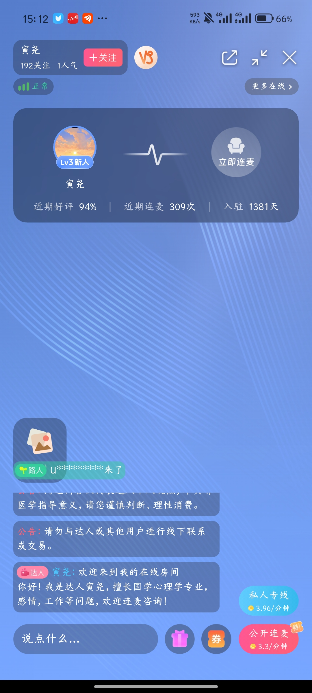

# 在线需求功能分析（基于现有截图）

## 1. 分析范围与原则

- 基准页面：`页面截图/页面-在线.jpg`
- 下级页面：`页面截图/在线/` 内 3 张截图
- 只记录截图中能够确认的结构、内容与状态。
- 无法由静态截图判断的连麦机制、计费、排队、权限及异常规则，统一列为待确认，不自行推断。

## 2. 页面定位

“在线”模块提供达人在线房间浏览和实时连麦入口。用户可以通过关注、全部、私人专线等频道查找达人，根据问题类型筛选房间，并选择公开连麦或私人专线。

## 3. 在线首页

### 3.1 顶部频道与搜索

| 元素 | 截图可确认功能 | 待确认 |
|---|---|---|
| 关注 | 查看已关注达人相关内容 | 空态、未登录状态 |
| 全部 | 查看全部在线内容，基准图中选中 | 默认排序与分页方式 |
| 私人专线 | 私人服务频道 | 落地页面与开通条件 |
| 搜索 | 搜索入口 | 搜索对象、历史、结果与无结果页 |

### 3.2 筛选与排序

可见条件：

- 综合排序；
- 达人等级；
- 技能；
- 问题；
- 筛选。

各下拉选项、组合筛选、重置、确认和结果空态尚未提供。

### 3.3 内容分类

横向分类至少包括：

- 热门；
- 情感关系；
- 分手复合；
- 事业发展；
- 个人发展。

截图右侧仍有未完整展示的内容，需确认全部分类数量、横向滑动和分类配置规则。

### 3.4 运营与快捷入口

- 热门提问：展示问题及可用免费连麦券；
- 连麦惊喜回馈季：活动横幅；
- 热门围观：展示达人在线解读、当前排队人数；
- 新人连麦券提醒：底部浮层展示即将过期，并提供“立即使用”和关闭按钮。

首页支持下拉刷新，已见“正在刷新”状态；刷新后的问题、达人、房间人数等内容会发生变化。

### 3.5 房间卡片

可见信息包括：

- 服务类型，如合盘、生辰、国学；
- 当前房间人数；
- 达人与连麦用户头像；
- 音频/连麦状态标识；
- 立即连麦入口；
- 问题标题；
- 达人昵称、等级、精选/自荐/小时榜等标签；
- 近期好评率、近期连麦次数及其他运营信息；
- 部分房间展示免费券或限时免费。

卡片点击区域、立即连麦与进入围观的区别、免费券使用方式待确认。

## 4. 单达人在线房间

### 4.1 房间顶部

- 达人昵称、关注数、人气；
- 关注按钮；
- 网络状态；
- 分享、缩放/全屏、关闭；
- 更多在线入口；
- 中部展示达人信息、等级、近期好评、近期连麦次数和入驻天数；
- 存在“立即连麦”座位。

### 4.2 房间内容与操作

- 公告与免责声明；
- 达人欢迎语和擅长领域；
- 用户进房提示；
- 文本输入框；
- 礼物入口；
- 优惠券入口；
- 私人专线价格，按分钟计费；
- 公开连麦价格，按分钟计费且显示券标记。

仍需补充：发言发送、礼物面板、券列表、公开连麦申请、私人专线申请、权限请求、支付确认、连接中与通话结束状态。

## 5. 双人连麦与麦序房间

相比单达人房间，截图进一步确认：

- 顶部可以显示多个在线用户头像；
- 主卡同时展示达人和另一名用户；
- 显示“1 麦序”；
- 房间仍保留私人专线和公开连麦入口；
- 可挂载生辰、图片等工具/内容入口；
- 达人欢迎语会说明用户可通过屏幕下方连麦。

“1 麦序”表示当前发言位、等待序号还是连麦队列人数，静态截图无法确认；另一名用户是正在连麦还是排队中也需确认。

## 6. 已确认的页面关系

| 编号 | 页面/操作 | 目标 | 证据充分度 | 页面健康度 |
|---|---|---|---|---|
| 1 | 底部导航“在线” | 在线首页 | 已确认 | 首页结构完整，筛选状态缺失 |
| 2 | 在线首页下拉 | 刷新首页内容 | 已确认 | 已见刷新中状态，失败态缺失 |
| 3 | 房间卡片/围观入口 | 在线房间 | 页面存在，具体点击区待确认 | 房间首屏完整，进入过程缺失 |
| 4 | 在线房间公开连麦 | 连麦/麦序状态 | 页面存在，状态含义待确认 | 麦序可见，申请与结束链路缺失 |
| 5 | 在线房间私人专线 | 私人通话流程 | 仅见入口 | 无落地页证据 |

## 7. 核心业务规则待确认

1. 关注、全部、私人专线三个频道的内容范围；
2. 进入房间是直接围观，还是需要先选择公开/私人连麦；
3. 公开连麦的申请、排队、叫号、超时和取消规则；
4. “麦序”的准确含义与人数计算方式；
5. 私人专线能否打断公开连麦，以及达人忙碌时的处理；
6. 按分钟计费的起算点、最小扣费单位和余额不足处理；
7. 免费券/新人券的适用范围、抵扣方式、有效期及退款；
8. 房间人数、人气、关注数和近期连麦次数的统计口径；
9. 房间内文字发言、礼物、图片、生辰等内容的使用权限；
10. 举报、禁言、拉黑、退出、断线重连及内容安全规则。

## 8. 优先补充截图

### P0：完成连麦闭环

1. 点击房间卡片后的进入/围观状态；
2. 点击“立即连麦”后的申请确认页；
3. 排队中、即将接通、连接中、连麦成功、通话结束；
4. 私人专线点击后的确认与通话页面；
5. 免费券选择与使用结果；
6. 测测币/余额不足和充值入口；
7. 麦克风权限拒绝、达人拒绝、用户取消和断线状态。

### P1：完善浏览与互动

1. 关注、私人专线频道页面；
2. 搜索页及搜索结果；
3. 排序、达人等级、技能、问题和筛选弹层；
4. 礼物面板与赠送结果；
5. 房间更多菜单、举报和拉黑；
6. 无在线达人、房间关闭、刷新失败与分页加载状态。

## 9. 文件整理

“在线”文件夹内 3 张截图已统一按“序号－页面－状态”命名，未发现重复文件。
