# 我的需求功能分析（基于现有截图）

## 1. 分析范围与原则

- 基准页面：`页面截图/页面-我的.jpg`
- 下级页面：`页面截图/我的/` 内 12 张截图
- 只记录截图能够确认的页面、信息和状态。
- 静态截图无法证明的账号规则、资产变动、支付、权限、删除和异常逻辑统一列为待确认，不自行推断。

## 2. 页面定位

“我的”是用户中心，集中展示身份资料、会员权益、账户资产、档案、商城、个人内容记录和设置入口。

## 3. 我的首页

### 3.1 用户资料卡

截图可见：

- 用户头像、用户编号/昵称；
- 关注数、粉丝数；
- 性别、年龄、星座；
- 3D人物形象；
- “注入灵魂复刻自己”入口；
- 右上角设置入口；
- 页面支持下拉刷新，基准图展示“取消刷新”状态。

资料卡、关注/粉丝列表、3D人物和“复刻自己”的落地页尚未提供。

### 3.2 会员权益

- 新用户限时优惠；
- 9.9 元开启陪伴；
- AI专业解答，每天10次解答；
- 马盘解读；
- DS解读，解锁50个档案。

会员名称、订阅周期、续费方式、权益限制、恢复购买和取消规则待确认。

### 3.3 资产与业务入口

首页展示：

- 测测币余额；
- 卡券数量；
- 报告与测试数量；
- 小星星数量；
- 档案；
- 商城。

### 3.4 个人记录

截图可见以下入口：

- 我的发布；
- 赞与收藏；
- 浏览记录；
- 提问；
- 我的小组。

页面下方还有“更多”区域，但基准截图未完整展示。

“心情日记”入口位于该未截全的“更多”区域，点击后进入心情日记页面。

## 4. 心情日记

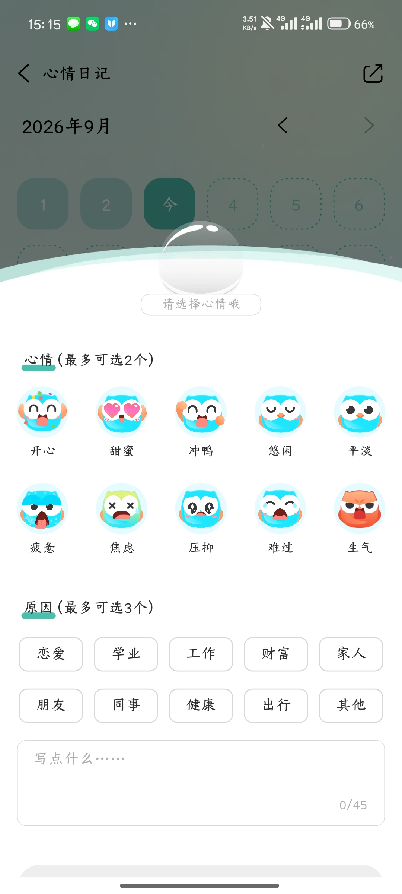

- 按月份查看日历；
- 左右切换月份；
- 选择日期；
- 选择心情，最多2个；
- 选择原因，最多3个；
- 原因包括恋爱、学业、工作、财富、家人、朋友、同事、健康、出行、其他；
- 可输入45字补充内容；
- 支持分享；
- 截图中未见明确保存按钮或保存成功反馈。

需补充：保存方式、编辑已有日记、删除、未保存退出、跨月历史和分享内容样式。

## 5. 个人内容与记录

### 5.1 我的小组

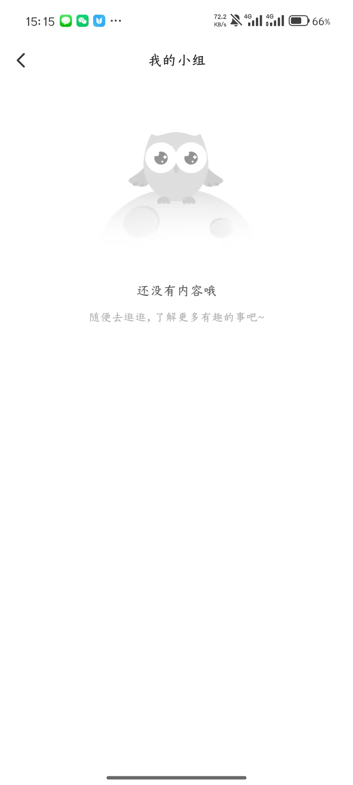

- 当前提供空状态；
- 文案引导用户去浏览更多内容；
- 小组列表、有数据状态、进入小组和退出小组流程未提供。

### 5.2 我的提问

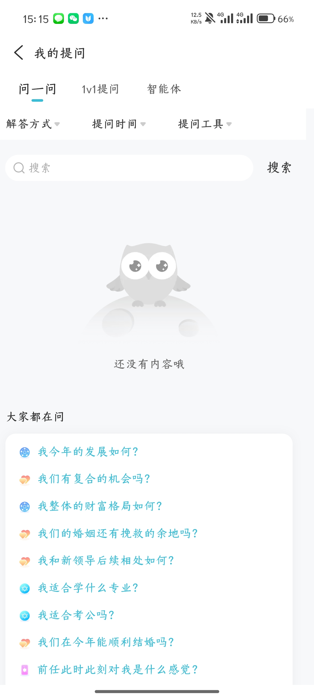

- 包含“问一问 / 1v1提问 / 智能体”标签；
- 支持按解答方式、提问时间、提问工具筛选；
- 支持搜索；
- 空状态下展示“大家都在问”的推荐问题；
- 有数据列表、订单状态、回答详情和删除记录未提供。

### 5.3 赞与收藏

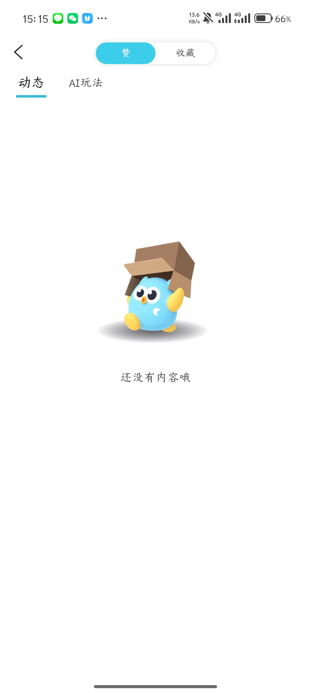

- 顶部切换“赞 / 收藏”；
- 内容类型切换“动态 / AI玩法”；
- 当前为“赞－动态”空状态；
- 其余三个组合状态及取消赞/取消收藏后的变化未提供。

### 5.4 我的发布

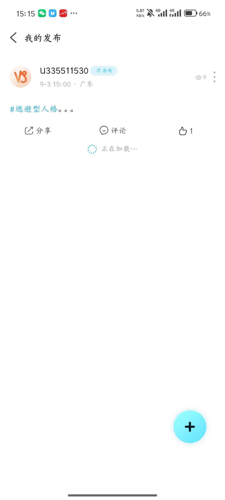

- 展示用户头像、昵称、标签、发布时间、地区、浏览量；
- 展示话题与正文；
- 提供分享、评论、点赞；
- 提供单条内容更多菜单；
- 右下角“+”用于新增发布；
- 截图包含“正在加载”状态；
- 编辑、删除、审核中、审核失败和仅自己可见状态未提供。

## 6. 档案管理

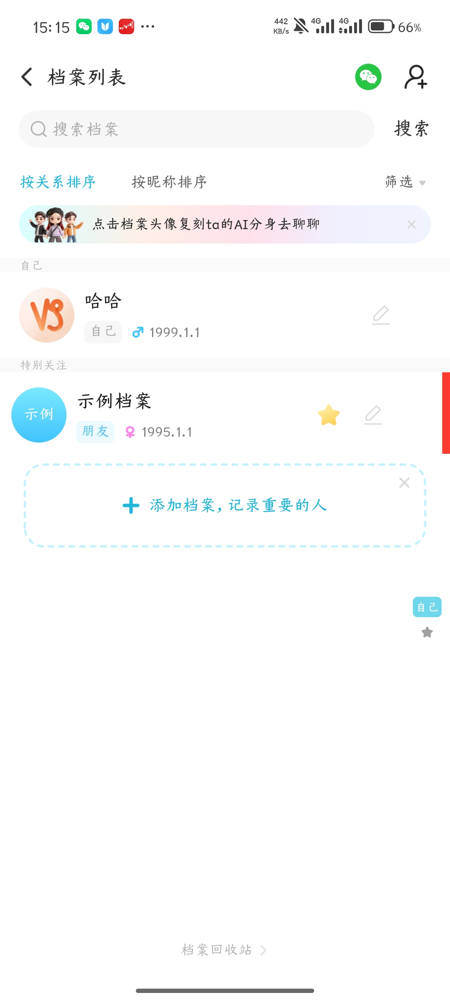

- 搜索档案；
- 按关系排序、按昵称排序及筛选；
- 微信邀请入口；
- 新增人物档案入口；
- 分为“自己”“特别关注”等分组；
- 档案展示头像、昵称、关系、性别、生日；
- 支持编辑；
- 支持标记特别关注；
- 点击档案头像可“复刻ta的AI分身去聊聊”；
- 支持继续添加档案；
- 底部提供档案回收站。

需补充：档案数量上限、删除确认、回收站恢复/彻底删除、排序筛选弹层、特别关注规则、AI分身授权和隐私规则。

## 7. 小星星

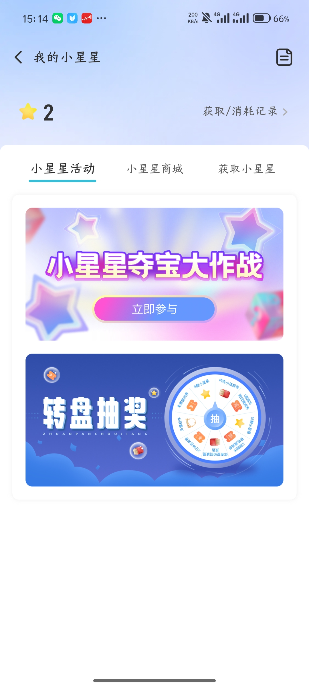

- 展示小星星余额；
- 提供获取/消耗记录；
- 包含“小星星活动 / 小星星商城 / 获取小星星”标签；
- 活动页可进入“小星星夺宝大作战”和转盘抽奖；
- 右上角还有规则/说明样式入口。

小星星商城、获取任务、兑换确认、余额不足、中奖结果和记录页未提供。

## 8. 已购买

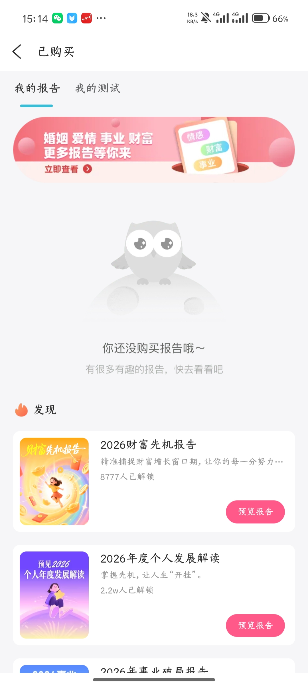

- 分为“我的报告 / 我的测试”；
- 报告空状态展示推荐内容；
- 推荐报告包含封面、标题、简介、解锁人数及“预览报告”；
- 购买后的报告列表、阅读进度、删除和恢复购买未提供。

## 9. 我的卡券

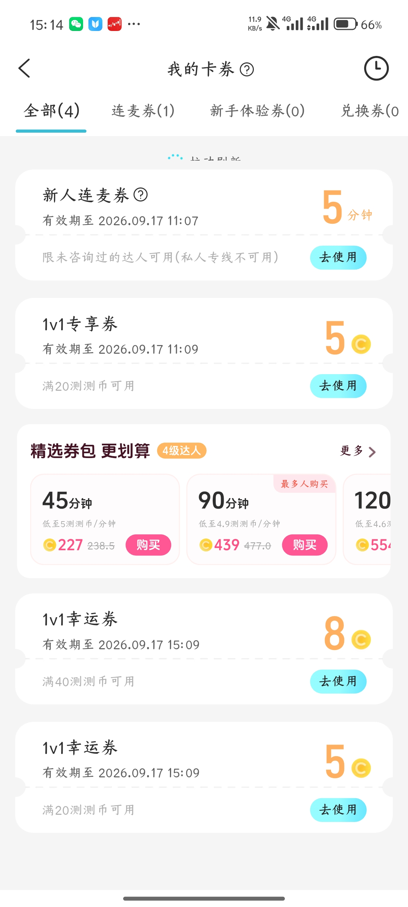

- 按全部、连麦券、新手体验券、兑换券分类；
- 顶部有帮助和使用记录入口；
- 券展示名称、有效期、面额/时长、使用条件和“去使用”；
- 展示精选券包，可横向选择45、90、120分钟等套餐并购买；
- 不同类型券的使用范围、叠加、过期、退款和购买结果待确认。

## 10. 我的测测币与充值

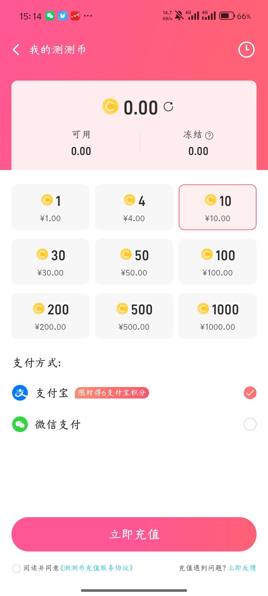

- 展示总余额、可用余额、冻结余额；
- 提供资产记录入口；
- 充值档位为1、4、10、30、50、100、200、500、1000测测币，对应等额人民币；
- 支持支付宝和微信支付；
- 支付宝存在积分活动提示；
- 充值前需勾选充值服务协议；
- 提供问题反馈入口；
- 底部提供立即充值。

需补充：未勾协议拦截、支付确认、支付成功/失败/取消、到账延迟、重复支付、退款、冻结原因与解冻规则。

## 11. 商城

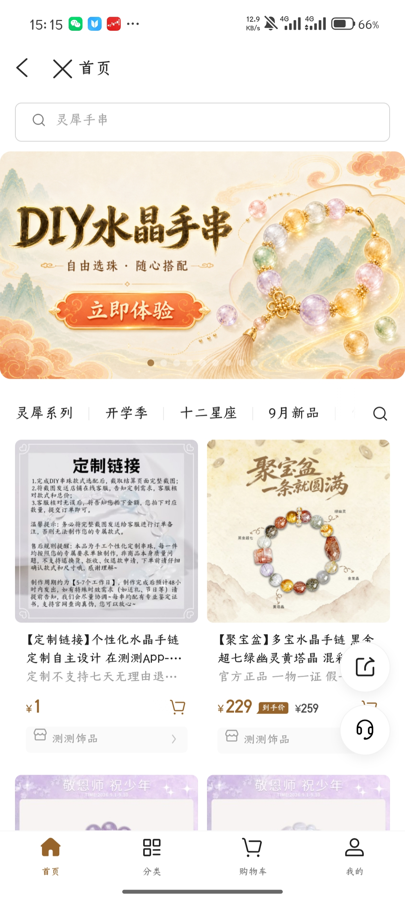

- 商城作为独立页面展示返回与关闭；
- 顶部搜索和轮播横幅；
- 分类标签及分类搜索；
- 双列商品列表；
- 商品卡展示图片、标题、简介、价格、划线价、购物车按钮和店铺；
- 右侧悬浮分享及客服；
- 底部导航为首页、分类、购物车、我的。

商品详情、规格选择、购物车、订单确认、地址、支付、物流、退款/售后和空状态未提供。

## 12. 设置

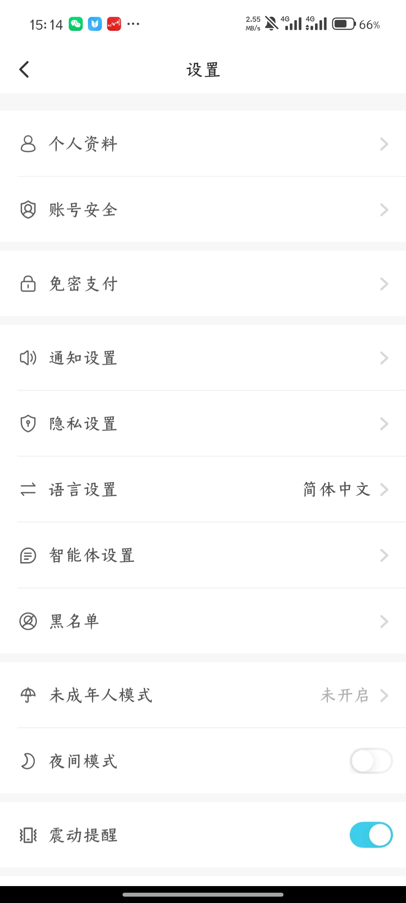

当前可见：

- 个人资料；
- 账号安全；
- 免密支付；
- 通知设置；
- 隐私设置；
- 语言设置，当前为简体中文；
- 智能体设置；
- 黑名单；
- 未成年人模式，当前未开启；
- 夜间模式开关；
- 震动提醒开关，当前开启。

截图未覆盖页面下半部分，退出登录、注销账号、关于、协议、版本和清理缓存等是否存在待确认。

## 13. 已确认的页面关系

| 编号 | 页面/入口 | 目标 | 证据充分度 | 页面健康度 |
|---|---|---|---|---|
| 1 | 底部导航“我的” | 我的首页 | 已确认 | 首页主体完整，下半部分缺失 |
| 2 | 设置齿轮 | 设置首页 | 已确认 | 设置项目清晰，下半部分缺失 |
| 3 | 测测币 | 测测币充值页 | 较明确，待确认 | 充值首屏完整，支付结果缺失 |
| 4 | 卡券 | 我的卡券 | 较明确，待确认 | 列表完整，使用结果缺失 |
| 5 | 报告与测试 | 已购买，默认展示“我的报告” | 已确认 | 空态完整，有数据状态缺失 |
| 6 | 小星星 | 我的小星星 | 较明确，待确认 | 活动首屏完整，商城/获取页缺失 |
| 7 | 档案 | 档案列表 | 已确认 | 列表完整，删除恢复流程缺失 |
| 8 | 商城 | 商城首页 | 已确认 | 首页完整，交易闭环缺失 |
| 9 | 我的发布 | 发布列表 | 已确认 | 列表可见，管理状态缺失 |
| 10 | 赞与收藏 | 赞与收藏 | 已确认 | 仅一个空态组合 |
| 11 | 提问 | 我的提问 | 已确认 | 空态完整，有数据状态缺失 |
| 12 | 我的小组 | 我的小组 | 已确认 | 仅空态 |
| 13 | “更多”区域中的心情日记入口 | 心情日记 | 已确认 | 编辑项完整，保存方式缺失 |

## 14. 优先补充截图

### P0：完成账户与资产闭环

1. 我的首页继续向下滚动后的“更多”区域；
2. 个人资料编辑、账号安全和退出登录页面；
3. 测测币充值成功、失败和充值记录；
4. 卡券选择、使用成功和过期状态；
5. 已购买报告/测试的有数据列表与内容详情；
6. 商城商品详情、购物车、订单确认、支付结果和订单列表；
7. 档案删除、回收站、恢复和彻底删除；
8. 心情日记保存后的日历状态与历史详情。

### P1：完善内容和设置

1. 我的发布编辑、删除、审核状态；
2. 赞与收藏其余标签组合；
3. 我的提问有数据列表与回答详情；
4. 我的小组有数据状态与小组详情；
5. 小星星商城、获取任务、中奖及消耗记录；
6. 设置下半部分及各子设置页面；
7. 关注、粉丝、3D人物和“注入灵魂复刻自己”页面。

## 15. 文件整理

“我的”文件夹内12张截图已统一按“序号－页面－状态”命名，未发现重复文件。
