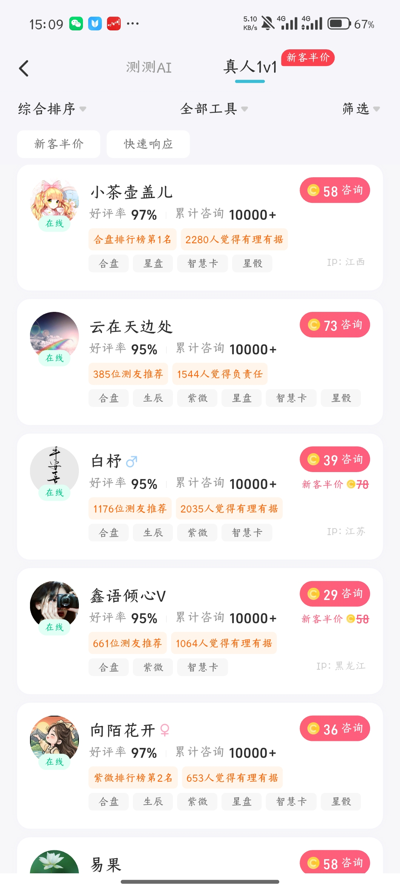
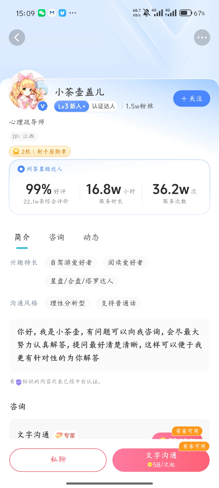
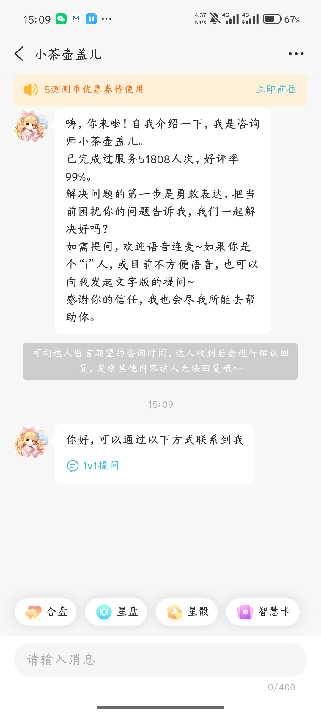

# 问AI需求功能分析（基于现有截图）

## 1. 分析范围与原则

- 基准页面：`页面截图/页面-问AI.jpg`
- 下级页面：`页面截图/问AI/` 内 5 张截图
- 只记录截图能够确认的页面、功能和状态。
- 无法由静态截图确认的跳转、计费、权限、异常与业务规则统一列入待确认，不自行推断。

## 2. 页面定位

“问AI”页面同时提供两类服务：

1. **测测AI**：用户可选择推荐问题、工具或直接输入问题，与 AI 进行内容交互。
2. **真人1v1**：用户选择一位或多位在线达人，进行私聊或付费文字咨询。

## 3. 测测AI首页

### 3.1 顶部导航

| 元素 | 截图可确认功能 | 待确认 |
|---|---|---|
| 返回 | 离开问AI页 | 返回目标页 |
| 测测AI | AI 服务主标签，当前选中 | 是否记忆上次标签 |
| 真人1v1 | 切换至真人服务 | 新客半价的资格与有效期 |
| 菜单 | 右上角三横线，带红点 | 菜单内容及红点消除规则 |

### 3.2 AI欢迎与推荐问题

- 展示 AI 形象、欢迎语和引导语；
- 展示四条推荐问题，每条带工具图标和进入箭头；
- 不同截图中的推荐问题不同，确认该区域支持内容刷新或动态更新；
- 页面支持下拉刷新，已见“正在刷新”和“释放刷新”状态；
- 推荐问题点击后的对话页与生成过程尚未提供。

### 3.3 真人咨询快捷区

- 展示当前在线达人数量；
- 提供“去提问”按钮；
- 支持向 1、3、8、15 位达人发起提问；
- “1 位达人”带新客折扣标记；
- 在线人数会随时间变化；
- 不同达人数量的选择、报价和答复方式尚未提供。

### 3.4 底部工具与输入区

当前可见：

- 工具下拉入口；
- 语音通话入口，带红点；
- 深度解读入口；
- 灵魂伴侣等横向扩展入口；
- 文本输入框；
- AI 内容免责声明。

工具列表、语音权限、录音状态、消息发送、AI回答、停止生成、重新生成和异常状态均未提供。

## 4. 真人1v1达人列表

### 4.1 筛选与排序

- 综合排序；
- 全部工具；
- 筛选；
- 新客半价；
- 快速响应。

下拉选项、筛选条件、选中态、重置与确认方式待补充。

### 4.2 达人卡片

卡片可见信息包括：

- 头像、昵称、性别标识、在线状态；
- 好评率与累计咨询量；
- 推荐人数、用户评价摘要或榜单信息；
- 擅长工具标签；
- IP 地区；
- 本次咨询所需测测币；
- 新客折扣及原价（部分达人展示）。

列表加载、分页、离线达人、无结果、价格变化和点击卡片后的规则待确认。

## 5. 真人达人个人主页

### 5.1 基础资料

- 头像、昵称、认证标识、等级、粉丝数；
- 关注按钮；
- 职业/身份与 IP 地区；
- 徽章；
- 好评率、评价数量、服务时长、服务次数。

### 5.2 内容标签

- 简介、咨询、动态三个标签页；
- 兴趣特长、沟通风格及个人介绍；
- 截图只覆盖简介页，咨询与动态列表未提供。

### 5.3 咨询入口

- 私聊；
- 文字沟通，展示起步价格及“有券可用”；
- 页面中还出现咨询服务卡片，但首屏下方内容未完整展示。

关注结果、私聊权限、优惠券使用和不同咨询产品的价格规则待确认。

## 6. 真人私聊会话

- 展示达人欢迎语和服务信息；
- 顶部展示优惠券待使用，并提供“立即前往”；
- 支持给达人留言，并提示达人确认咨询时间后回复；
- 达人可在会话中发出“1v1提问”入口；
- 底部提供合盘、星盘、星骰、智慧卡等工具快捷标签；
- 输入框限制为 400 字；
- 右上角有更多菜单。

仍需补充：发送按钮、键盘态、消息发送成功/失败、图片或语音能力、会话举报/拉黑、达人回复、咨询订单在会话中的状态变化。

## 7. 文字沟通下单页

### 7.1 咨询信息

- 展示达人摘要、等级、专家标识、活跃状态、好评率及推荐人数；
- 当前为“文字沟通”，语音沟通显示锁定；
- 可选择合盘、星盘、星骰、智慧卡；
- 输入问题，限制 200 字；
- 选择档案。

### 7.2 支付信息

- 支持支付宝；
- 支持测测币，并显示余额；
- 支持卡券抵扣；
- 展示会员优惠；
- 底部同时提供 SVIP 专享价格与立即购买价格。

仍需补充：字段必填校验、无可用档案、档案选择、卡券列表、余额不足、支付宝确认、支付成功/失败、取消订单、退款与达人未回复处理。

## 8. 当前页面关系

| 编号 | 页面/操作 | 目标 | 证据充分度 | 页面健康度 |
|---|---|---|---|---|
| 1 | 问AI底部导航 | 测测AI首页 | 已确认 | 首屏完整，对话链路缺失 |
| 2 | 测测AI页切换“真人1v1” | 真人达人列表 | 已确认 | 列表完整，筛选状态缺失 |
| 3 | 点击达人卡片 | 真人达人个人主页 | 较明确，待确认 | 简介完整，其他标签缺失 |
| 4 | 达人主页点击“私聊” | 真人私聊会话 | 较明确，待确认 | 会话首屏完整，消息状态缺失 |
| 5 | 达人主页点击“文字沟通” | 文字沟通下单页 | 较明确，待确认 | 下单首屏完整，支付结果缺失 |

## 9. 优先补充截图

### P0：完成核心闭环

1. 点击推荐问题或发送自定义问题后的 AI 对话页；
2. AI 回答生成中、完成、失败及次数不足状态；
3. “工具”展开后的完整选项；
4. 选择 1/3/8/15 位达人的下一步页面；
5. 达人列表的排序、工具和筛选弹层；
6. 达人主页的“咨询”“动态”标签页；
7. 私聊消息实际发送与达人回复状态；
8. 文字咨询的档案选择、卡券选择、支付成功和支付失败页面。

### P1：异常与边界

1. 达人离线、忙碌、停止接单；
2. 测测币不足、优惠券失效、支付宝取消；
3. 达人超时未回复、退款或申诉；
4. 会话举报、拉黑与删除；
5. 未登录或未创建档案时的拦截；
6. 真人列表加载失败、空结果与分页加载。

## 10. 文件整理

“问AI”文件夹内 5 张截图已统一按“序号－页面－状态”命名，未发现重复文件。
