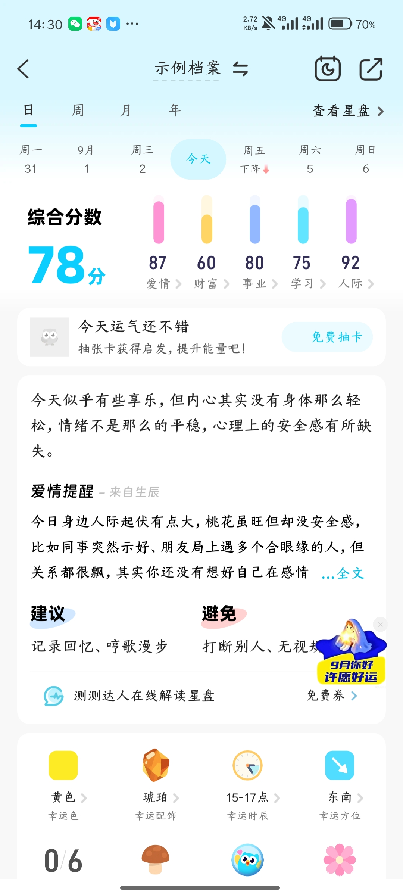
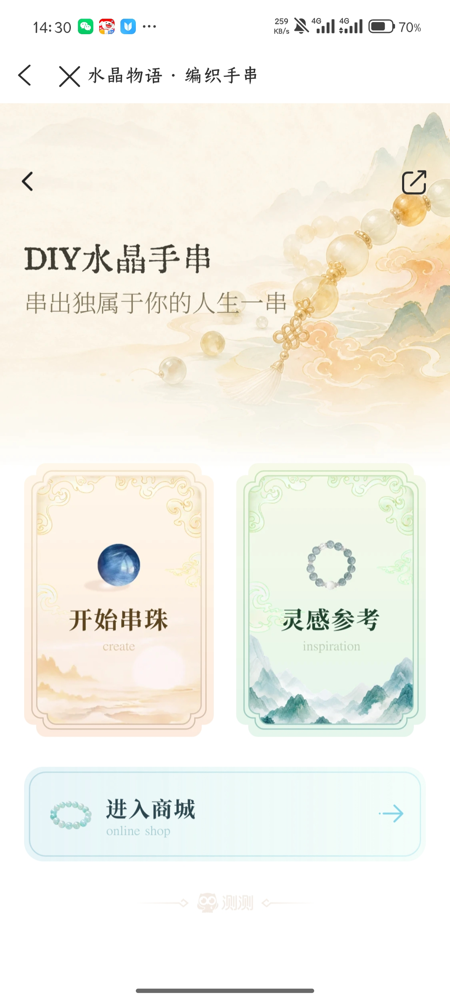
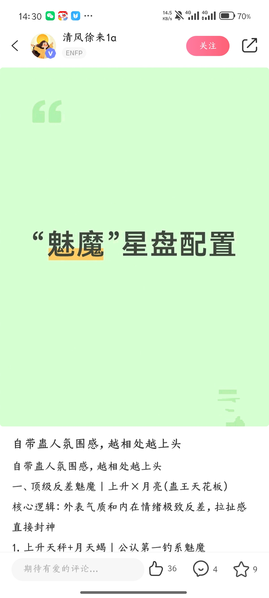
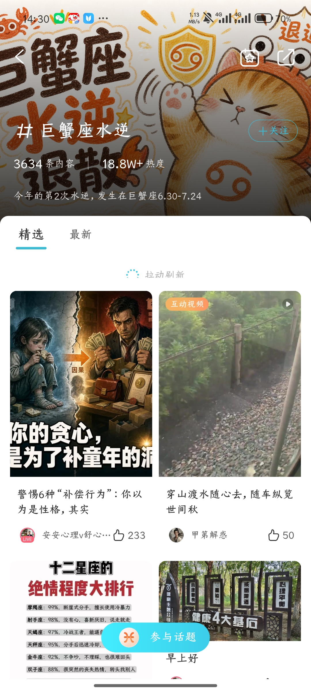
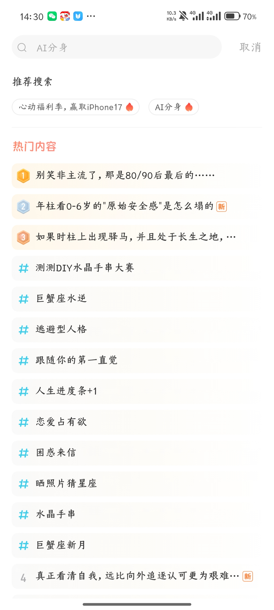
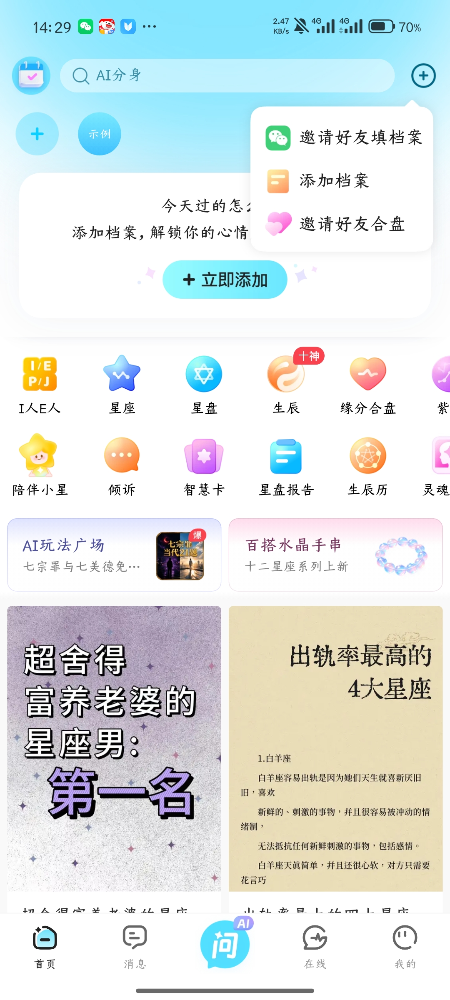
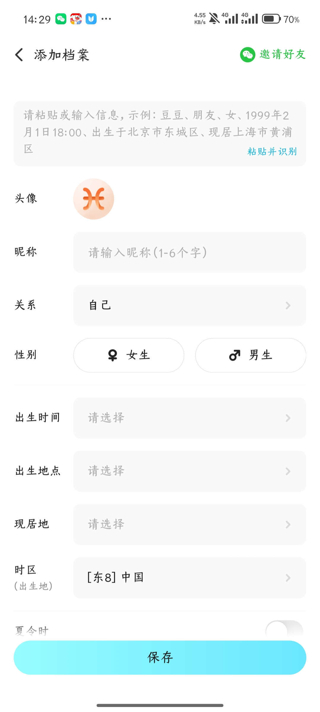
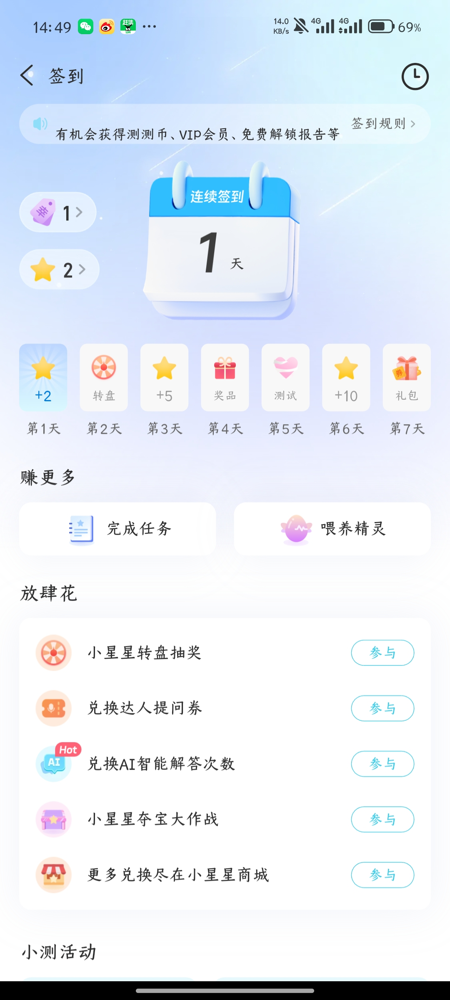
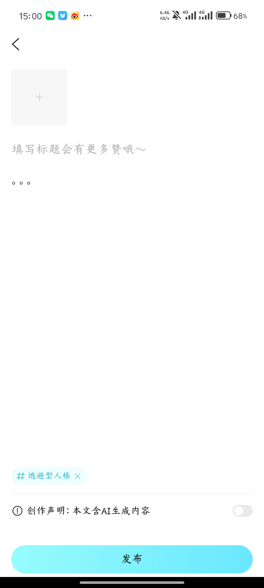
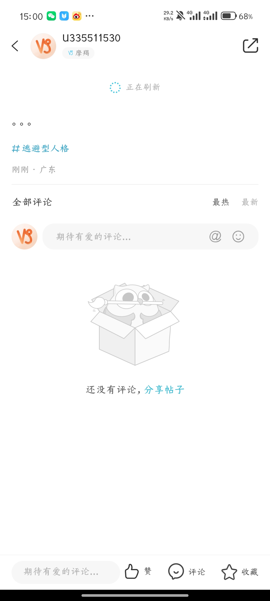

# 首页需求功能分析（基于现有截图）

## 1. 分析范围与原则

- 基准页面：`页面截图/页面-首页.jpg`
- 下级页面：`页面截图/首页/` 内 15 张已整理并重命名的截图
- 本文只记录截图中可以确认的功能、状态与页面结构。
- 无法从静态截图确认的交互、规则、接口、权限和异常状态，统一列入“待补充/待确认”，不作推断。

## 2. 首页页面定位

从截图可确认，首页是一个聚合入口页，包含以下四类内容：

1. 档案入口及档案摘要；
2. 测算/内容工具快捷入口；
3. 活动或功能推广入口；
4. 双列内容推荐流。

页面底部固定展示五个一级导航：首页、消息、问 AI、在线、我的。

## 3. 首页模块拆解

### 3.1 顶部操作区

| 元素 | 截图可确认功能 | 当前状态/展示 | 待确认 |
|---|---|---|---|
| 左侧日历样式图标 | 进入签到页 | 签到页展示连续签到、7 日奖励、赚取任务、兑换活动等 | 签到规则详情、补签、历史记录、奖励到账规则 |
| 搜索框 | 进入搜索页 | 展示运营词“心动福利季，赢取 iPhone17” | 默认词来源、轮播规则、搜索记录、结果页 |
| 右上角“+” | 展开快捷菜单 | 菜单含“邀请好友填档案 / 添加档案 / 邀请好友合盘” | 点击外部关闭、再次点击关闭、登录限制 |

### 3.2 档案快捷区

| 元素 | 截图可确认功能 | 状态 |
|---|---|---|
| 圆形“+” | 新增档案入口 | 首页始终可见 |
| “示例”档案 | 切换/选中示例档案 | 选中时有圆环高亮 |
| 列表图标 | 档案列表入口 | 落地页未提供 |
| 向上箭头 | 收起档案区 | 已补充另一种首页顶部形态，具体收起动画待确认 |
| 人物图标 | 展示/切换其他人物档案 | 用于显示不同示例，即不同人的档案 | 展开层样式、档案数量上限、排序规则 |

### 3.3 档案主卡

首页存在两种已确认状态：

1. **无档案状态**：提示“添加档案，解锁你的心情启示和行动建议吧”，主按钮为“立即添加”。
2. **已有/示例档案状态**：展示档案名、收藏标记、今日心情综合分、简要文案，以及爱情、财富、事业、学习、人际五项分数；右上角有“更多”。

新增截图还确认了“自己/真实档案”被选中时：首页主卡展示档案昵称、90 分综合分及五项分数；首页顶部操作区出现右上角“+”与人物图标。人物图标用于显示/切换不同示例，即不同人物的档案。

“更多”进入档案详情页，详情页截图可确认包含：

- 日/周/月/年切换；
- 日期选择与“今天”定位；
- “查看星盘”入口；
- 综合分及五项分数；
- 免费抽卡入口；
- 今日说明、爱情提醒、建议、避免；
- 在线解读入口；
- 幸运色、幸运配饰、幸运时辰、幸运方位等信息。

新增“自己”档案详情截图进一步确认：示例档案与个人档案共用同一详情结构，分数、提醒类型、建议/避免和幸运信息随档案变化。

### 3.4 功能宫格

截图中可见的入口包括：

- I 人 E 人 / ISTJ（名称随所选档案或状态发生变化，变化规则待确认）；
- 星座；
- 星盘；
- 生辰（带“十神”角标）；
- 缘分合盘；
- 紫色图标入口（名称未完整显示）；
- 陪伴小星；
- 倾诉；
- 智慧卡；
- 星盘报告；
- 生辰历；
- 灵魂类入口（名称未完整显示）。

宫格在屏幕宽度之外仍有内容，截图显示为横向延伸；是否支持横向滑动、总入口数量、排序和个性化规则待确认。

### 3.5 横幅入口

当前可见两个并列横幅：

- AI 玩法广场；
- 百搭水晶手串。

AI 玩法广场落地页包含：热门、开学季、关注、上新、心动站等频道，双列应用卡片、搜索、作者、热度等信息。

水晶手串落地页包含“开始串珠”“灵感参考”“进入商城”三个入口，以及返回、关闭、分享操作。

### 3.6 推荐内容流

首页下半部分为双列卡片流，当前截图能确认：

- 支持下拉刷新，并显示“正在刷新/拉动刷新”状态；
- 已补充“释放刷新”状态，说明下拉刷新至少包含“下拉中—达到阈值—刷新中”三个可见阶段；
- 卡片至少包含封面和标题；
- 点击内容卡进入内容详情；
- 内容详情展示作者、认证/标签、关注、分享、正文、点赞、评论、收藏；
- 内容可归属话题，话题详情页包含封面、内容数、热度、简介、关注、精选/最新切换及参与话题按钮。
- 已补充带指定话题标签的内容发布页，以及内容详情的评论空态。

## 4. 已确认的页面与入口关系

| 编号 | 起点/操作 | 目标页面 | 证据充分度 | 页面健康度 |
|---|---|---|---|---|
| 1 | 首页 | 首页聚合页 | 已确认 | 结构完整，交互状态仍缺 |
| 2 | 点击搜索框 | 搜索推荐/热门内容页 | 已确认 | 首屏完整，结果态缺失 |
| 3 | 点击右上角“+” | 快捷菜单 | 已确认 | 菜单项完整，关闭规则缺失 |
| 4 | 点击“添加档案”类入口 | 添加档案表单 | 已确认 | 主字段完整，校验与选择器缺失 |
| 5 | 点击档案主卡“更多” | 示例档案详情 | 较明确 | 内容完整，日期/周期切换状态缺失 |
| 6 | 点击 AI 玩法广场横幅 | 玩法广场 | 已确认 | 列表完整，频道状态与分页缺失 |
| 7 | 点击百搭水晶手串横幅 | DIY 水晶手串 | 已确认 | 首屏完整，三个后续流程缺失 |
| 8 | 点击推荐内容卡片 | 内容详情 | 已确认 | 主互动齐全，评论区及状态变化缺失 |
| 9 | 点击话题入口 | 话题详情 | 页面存在，具体入口位置待确认 | 主结构完整，关注/参与流程缺失 |
| 10 | 点击首页左上角日历图标 | 签到页 | 较明确，待口头确认 | 首屏完整，规则与奖励结果缺失 |
| 11 | 话题页“参与话题” | 带话题标签的发布页 | 已确认 | 编辑首屏完整，发布结果缺失 |
| 12 | 内容详情进入评论区/详情下半部分 | 评论空态 | 已确认 | 空态、输入入口完整 |

## 5. 子页面功能要求（截图可确认部分）

### 5.1 搜索页

- 顶部搜索输入框与取消按钮；
- 推荐搜索词标签；
- 热门内容排行，至少包含序号、新内容标记、话题/内容条目；
- 点击推荐词、热门内容后的结果页未提供；
- 未提供输入中、搜索结果、无结果、历史记录和清空历史状态。

### 5.2 快捷菜单

- 邀请好友填档案；
- 添加档案；
- 邀请好友合盘；
- 当前只确认弹层形态，未确认分享渠道、邀请链接、被邀请方流程。

### 5.3 添加档案

可见字段：

- 自然语言粘贴/输入及“粘贴并识别”；
- 头像；
- 昵称（1–6 个字）；
- 关系；
- 性别；
- 出生时间；
- 出生地点；
- 现居地；
- 出生地时区；
- 夏令时；
- 保存。

仍需确认：必填项、识别结果回填、日期精度、地点选择层级、时区自动计算、夏令时默认值、错误提示、保存成功后去向、档案数量上限。

### 5.4 玩法广场

- 顶部返回与搜索；
- 频道切换；
- 双列应用卡片；
- 应用标题、副标题、封面、作者、热度；
- 部分卡片存在“互动视频”类型标记；
- “关注”频道的内容来源、频道分页、搜索结果及应用详情未提供。

### 5.5 DIY 水晶手串

- “开始串珠”进入创作流程；
- “灵感参考”进入参考内容；
- “进入商城”进入商品购买流程；
- 返回、关闭、分享；
- 创作、保存、商品详情、购物车、结算、支付结果等页面未提供。

### 5.6 内容详情

- 作者信息、身份/标签、关注；
- 分享；
- 图文正文；
- 点赞、评论、收藏及计数；
- 评论输入框；
- 只提供了一个内容详情首屏，未提供正文长图翻页、评论列表、互动后的选中态、举报/不感兴趣等操作。

### 5.7 话题详情

- 话题封面、名称、内容数量、热度、简介；
- 关注/取消关注；
- 收藏与分享图标；
- 精选/最新频道；
- 下拉刷新；
- 双列内容流；
- 参与话题；
- 新增发布页截图包含：图片添加入口、标题输入提示、正文编辑区、预置且可移除的话题标签、“本文含 AI 生成内容”声明开关及发布按钮；发布成功/失败、草稿保存、图片上限、标题/正文字数等规则仍缺失。
- 仍缺少频道空态/加载态、内容举报与管理规则。

### 5.8 签到页

- 展示连续签到天数；
- 展示两类累计资产/积分入口，图标分别为票券和星星，准确名称待确认；
- 展示 7 日签到奖励，第 2、4、5、7 天为转盘/奖品/测试/礼包等非固定数值奖励；
- “赚更多”包含完成任务、喂养精灵；
- “放肆花”包含转盘抽奖、兑换达人提问券、兑换 AI 解答次数、夺宝活动、商城；
- 顶部存在签到规则和历史记录入口；
- 缺少签到成功、重复签到、奖励领取、任务详情、兑换确认和余额不足状态。

### 5.9 内容发布页与评论空态

- 发布页支持添加图片、填写标题和正文、携带/移除话题、标注 AI 生成内容、发布；
- 评论区支持最热/最新排序、评论输入、@ 用户和表情；
- 无评论时展示空态，并提供“分享帖子”引导；
- 评论详情截图顶部出现“正在刷新”；正文区域只显示省略符号，这是帖子本身的正常正文内容，并非加载异常。

## 6. 首页核心业务规则（待产品确认）

以下规则无法从现有截图确定，PRD 中不能直接落结论：

1. 首页是否允许未登录浏览，哪些操作必须登录；
2. 首页默认选中的档案，以及多档案切换逻辑；
3. 示例档案是否永久存在、能否删除、是否计入档案上限；
4. 今日分数的更新时间、时区依据及缓存规则；
5. 宫格入口的固定顺序、横滑规则、角标运营配置；
6. 横幅是否后台配置、是否轮播、是否支持下线和人群定向；
7. 内容流推荐、分页、去重、刷新、曝光和不感兴趣规则；
8. 点赞、收藏、关注、评论的登录拦截与失败回滚；
9. 分享渠道、分享卡片样式及深链回流；
10. 网络异常、接口失败、无数据、内容删除/下架等兜底。

## 7. 建议优先补充的截图

### P0：完成首页功能闭环必需

1. 点击人物档案入口后，不同人物档案的展示/切换页面；
2. 搜索输入后的结果页、无结果页；
3. 添加档案各选择器（关系、出生时间、出生地点、现居地、时区）及保存成功/失败状态；
4. “开始串珠”完整流程；
5. 评论有数据状态，以及点赞/收藏/关注后的状态；
6. 内容发布成功、失败和草稿退出提示；
7. 签到成功、重复签到及奖励到账状态。

### P1：完善边界与运营规则

1. 档案数量达到上限；
2. 无网络、加载失败、空内容流、内容下架；
3. 邀请好友填档案与邀请好友合盘的分享页、被邀请方落地页；
4. 玩法广场应用详情、关注频道、搜索结果；
5. 水晶商城的商品详情、购物车、结算与支付结果；
6. 首页首次进入、未登录、已登录但无档案三种状态。

## 8. 当前结论

现有截图足以建立首页的信息架构和主要入口清单，也能确认“档案—工具—活动—内容流”四层结构。新增截图补齐了个人档案、下拉刷新、签到、话题发布和评论空态，但仍不足以写完可直接开发验收的完整 PRD，主要缺口集中在：少数入口映射、表单校验、互动状态、加载/失败态、登录限制、发布与交易闭环。

## 9. 文件整理结果

- 首页文件夹内截图已统一按“序号-页面/入口-状态”规则重命名，共 15 张。
- 重复的“示例档案详情”截图已移入回收站，只保留 `05-档案详情-示例档案.jpg`。
- 后续新增截图建议沿用同一命名方式，避免使用随机哈希文件名。
