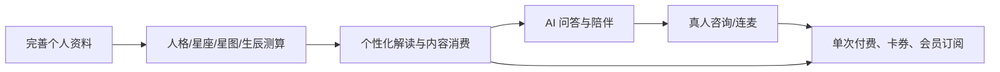

# 测测核心功能调研

> 调研日期：2026-09-03
>
> 结论基于工作区 13 张产品截图、页面流程及公开检索结果综合判断。公开网页存在第三方下载站和旧版本描述，因此只将其用于验证产品对外定位，不将其作为具体功能实现的唯一证据。

## 结论

测测的核心不是单一的“星座工具”，而是以**泛心理与命理内容为切入、通过解读和陪伴满足情感/自我探索需求、以 AI 和真人咨询完成服务与商业转化**的产品。

核心业务链路如下：

## 核心功能分层

### P0：测算与个性化解读引擎

这是最核心的用户价值和产品识别度来源，其他模块大多围绕它导流、留存或变现。

- **基础资料建档**：性别、出生时间、出生地、现居地；用于提高星盘和生辰结果准确度。
- **自我探索测评**：隐藏人格类型测试、九型人格等，通过题目、量表、进度和报告形成闭环。
- **星座与星盘解读**：太阳/月亮/上升、星体配置、宫位、相位连线、人格标签、核心特质和星座名片。
- **生辰解读**：生辰格局、五行比例、十神、生克关系、神煞、日支、喜用颜色、行业与伴侣建议。
- **关系类测算**：缘分合盘等，以“我与他人”的关系问题扩展使用场景。

判断依据：首页将星座、星盘、生辰、人格等置于工具主入口；“我的解读”提供星座、星图、生辰三个一级标签，并已形成从资料采集到可视化结果与文字报告的完整路径。

### P0：AI/真人陪伴与咨询服务

这是解决用户深层问题、提高客单价的服务闭环。

- **AI 问答与深度陪伴**：提问、解读、倾诉、灵魂陪伴等低门槛即时服务。
- **真人 1v1 咨询**：达人供给、工具/价格/响应速度筛选、优惠券、新客价、下单咨询。
- **在线互动咨询**：在线频道、语音房/连麦、私人专线等，适合承接围观、即时问答和转化。

判断依据：截图中真人咨询有独立顶级页签、达人列表、价格、新客优惠券及筛选体系；会员权益直接销售 AI 解答、马盘解读和 DS 解读，说明“解读/陪伴服务”是付费权益核心。

### P1：内容、社区与情绪留存

该层并非核心能力本身，但承担激活、日活和向咨询转化的作用。

- **首页内容流与运营专题**：人格测试、图文内容、活动 Banner、商品推荐。
- **心情档案/心情日记**：记录当天情绪和事件，并输出心情启示、行动建议。
- **消息与分身雷达**：系统/活动通知、同频用户发现、未读提醒。
- **个人内容资产**：发布、收藏、浏览、提问、小组、档案。

判断依据：公开产品描述强调“心理测试、倾诉、心理沙盘”和“情感陪伴”；截图将每日档案、内容推荐、在线互动放在高频导航位置。

### P1：商业化与服务供给体系

它支撑核心业务的收入与供给，但不是用户进入产品的首要原因。

- **会员订阅**：连续包月/季/年，会员权益差异与自动续费。
- **单次服务付费**：真人咨询价格、订单、支付和售后。
- **卡券与新客优惠**：通用券、连麦券、报告券、新用户半价。
- **虚拟币/商城**：测测币、商品及相关资产管理。
- **达人侧供给**：达人展示、平台入驻、评价与信用等级。

判断依据：会员页展示 VIP/SVIP 分档、礼包、权益次数对比和支付按钮；真人咨询页直接展示咨询价格与领券入口。

### P2：辅助与运营功能

这些是必要的产品基础设施，但不建议被定义为核心卖点。

- 搜索、签到、刷新、通知权限与消息管理
- 个人资料、设置、账户资产和兑换码
- Banner 配置、推荐位、活动角标与推送
- 分享、名片、收藏、浏览历史与反馈

## 最应优先保留的最小闭环

若需要做 MVP 或评估重构优先级，建议优先保留以下闭环：

1. 用户填写出生资料与基础档案。
2. 生成星座/星图/生辰或人格测试结果。
3. 提供可读、可继续追问的个性化解读。
4. 用 AI 问答承接即时需求。
5. 对复杂情感、关系或事业问题导向真人咨询。
6. 通过会员、卡券或单次订单完成付费。

在此之前，语音房、分身雷达、商城、复杂社交关系和大规模内容社区都可以后置。

## 核心功能与截图文件对应

| 核心能力 | 代表页面 | 来源图片 |
| --- | --- | --- |
| 人格测评 | 隐藏人格类型测试介绍/答题 | `1a8b544fe9032c4d82ebce6c471acdda.jpg`、`8425019907be03dedbf82f8498429bc1.jpg` |
| 星座与星盘 | 我的解读（星座/星图） | `9d52884cc49a88eb3b7e38caf560717f.jpg`、`9886fb2a1db0e523e3ad9a4fb869a463.jpg` |
| 生辰解读 | 我的解读（生辰） | `3e4d68f81cd85f4362155bb99a730602.jpg`、`fae393e12c0d7ef60eb2739023aef47e.jpg` |
| 资料建档 | 个人资料完善 | `1914879924f90b88fc37d00ff81c3c89.jpg` |
| 真人服务 | 真人 1v1 咨询 | `49c53fcd8b227f51eb7aed1926a9d80d.jpg` |
| 会员变现 | 测测会员 | `fe093cb15a3f786ab8b0b7b38e2575e1.jpg` |
| 内容与留存 | 首页、消息、个人中心 | `9e7c054b089b18a8ddde2141f67985f3.jpg`、`6b609722ac1c74b49c9af7785ca1ec64.jpg`、`79ab176a2eb895cb5664d14776fea418.jpg` |

## 公开信息交叉验证

- 百度检索结果中的“测测 - 星座/心理测试/倾诉/心理沙盘”将星座、心理测试、倾诉和心理沙盘列为产品标签，并描述其为情感陪伴产品。来源：[百度检索结果](https://www.baidu.com/s?wd=%E6%B5%8B%E6%B5%8B%20App%20%E6%98%9F%E7%9B%98%20%E5%92%A8%E8%AF%A2)。
- 同一公开检索结果中，“测测星盘”被描述为以星座测试和星座分析为主的产品。该项可能来自第三方分发页面，仅用于佐证星盘/星座是对外认知标签，不用于确认当前版本细节。来源：[百度检索结果](https://www.baidu.com/s?wd=%E6%B5%8B%E6%B5%8B%20App%20%E6%98%9F%E7%9B%98%20%E5%92%A8%E8%AF%A2)。
- 工作区截图进一步确认当前版本已经将 AI 解读、真人 1v1、会员权益和在线互动纳入实际产品流程，因此它的核心已从单纯工具扩展为“测算内容 + 陪伴服务 + 咨询交易”。

## 结论边界

- 本文将“核心”定义为：同时满足用户主要价值、产品入口权重、跨页面复用，以及直接支撑留存或收入的能力。
- 公开可访问的商店详情页在本次检索环境中未能稳定打开；因此具体套餐、价格、达人规模等以工作区截图为准，不将搜索摘要视为版本事实。